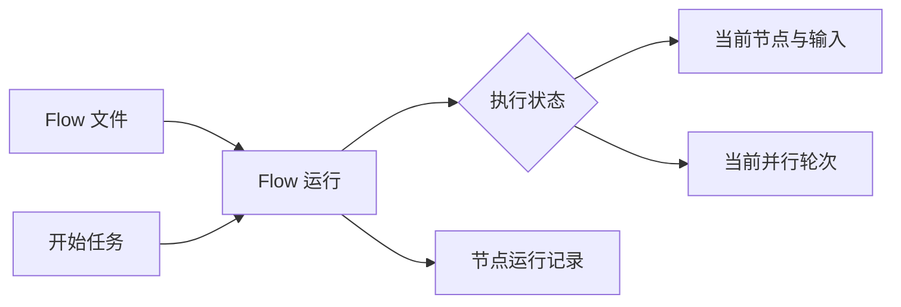
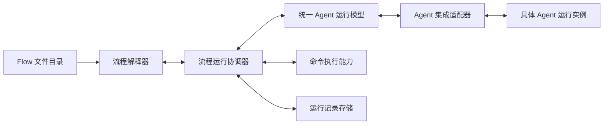
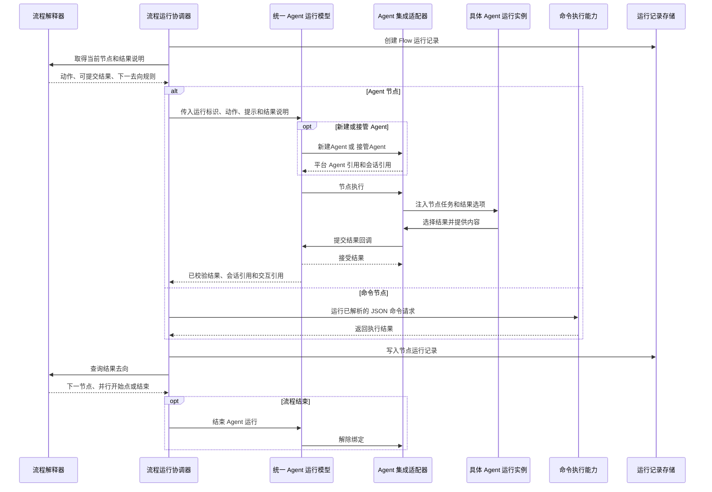
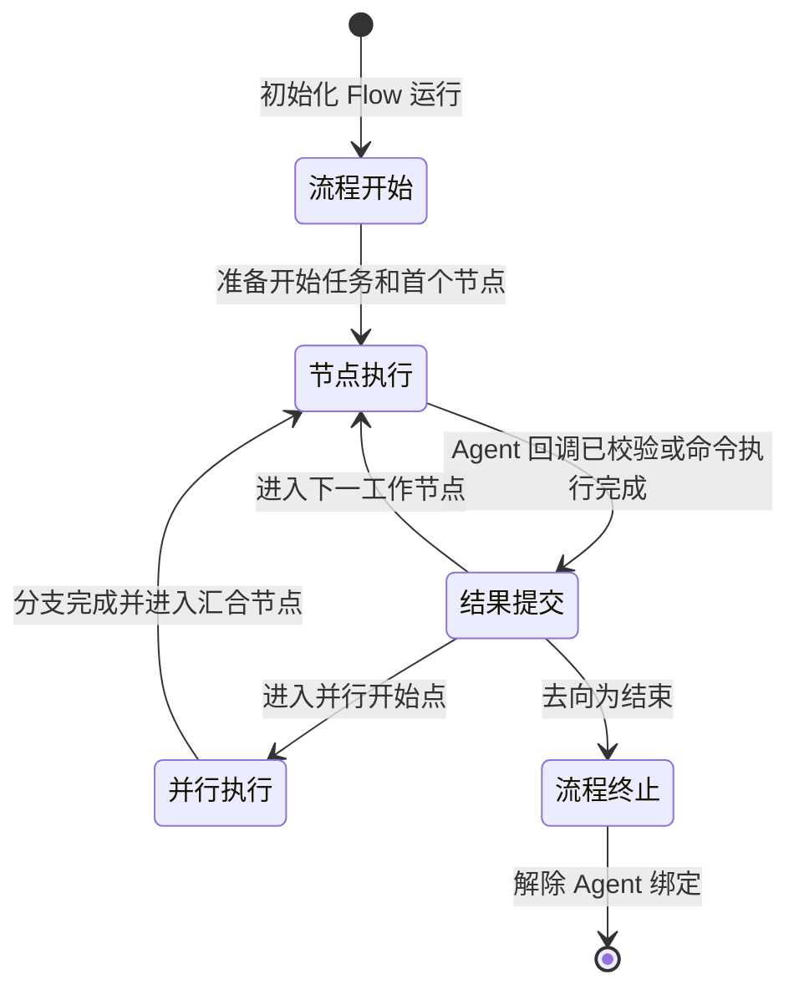

# Agent Flow Runtime 架构设计

## 1. 定位

Agent Flow Runtime 负责运行 Flow。Flow 文件定义可复用的工作方法，Runtime 将它和一次具体任务结合，驱动节点、调用 Agent 或命令、保存运行记录，并按节点结果继续流转。

Flow 的格式、动作和并行规则由[Flow 概览](flow-overview.md)和[Flow 规范](flow-spec.md)定义。Runtime 消费该规范，不改变 Flow 的路径含义。

## 2. 核心模型

系统围绕一次 Flow 运行组织。它引用一个 Flow，并持有本次的开始任务、节点运行记录，以及两种互斥的执行状态：当前工作节点及其输入，或当前并行轮次。统一 Agent 运行模型以 Flow 运行标识维护对应的 Agent 绑定和交互。

Flow 是静态文件，只描述工作节点、结果边、并行开始点和节点动作。运行记录属于 Flow 运行，记录每次进入节点的输入、结果和 Agent 交互引用。循环、返工和并行执行都会新增节点记录，历史记录保持可追溯。



## 3. 整体结构



流程解释器读取静态 Flow。流程运行协调器拥有一次运行的动态状态。统一 Agent 运行模型定义 Agent 节点的通用执行方式，Agent 集成适配器处理具体平台的会话和消息。命令执行能力处理命令动作，运行记录存储保存并按 Flow 标识查询运行历史。

## 4. 模块设计

### 4.1 Flow 文件目录

Flow 文件目录负责保存、发现和加载 Flow。它读取`name`和`description`，用于展示和按适用情况查找可复用 Flow。文件标识来自文件名。

### 4.2 流程解释器

流程解释器只理解 Flow 文件。

- 加载 Mermaid 图、节点动作和结果说明，检查基本结构。
- 根据当前节点返回动作、可提交结果和结果说明。
- 根据“节点引用名 + 结果名”返回下一节点、并行开始点或结束标记。
- 识别并行开始点、汇合节点及其直接分支来源。

解释器不执行动作、不保存某次运行状态，也不判断业务结果。

### 4.3 流程运行协调器

流程运行协调器是一次 Flow 运行的唯一状态所有者。

- 创建运行并保存开始任务；启动参数带有已有 Agent 引用时，将其连同运行标识传给统一 Agent 运行模型。
- 进入节点时创建节点运行记录，并准备节点输入和`{outcome}`。
- 以运行标识将 Agent 动作、引导提示和可提交结果交给统一 Agent 运行模型，将命令动作交给命令执行能力。
- 接收节点结果，通过解释器取得下一去向。
- 到达并行开始点时，以并行轮次替代当前节点，保存输入快照并启动命令分支；轮次分别持有每个分支的节点执行和输入。全部分支到达后，将汇合节点设为当前节点并执行。
- 在 Agent 节点记录中保留模型返回的会话引用和交互引用。结束时请求模型解除该运行的 Agent 绑定，保留全部运行和节点记录，供后续按 Flow 标识查询。

并行轮次包含输入快照和本轮每个分支的节点记录。分支与汇合节点的`{outcome}`都来自输入快照。协调器只在已通过解释器校验的汇合节点中，以本轮来源节点记录替换`{节点引用名.outcome}`。

### 4.4 统一 Agent 运行模型

统一 Agent 运行模型是 Agent Flow 的通用运行时模型。它按 Flow 运行标识维护 Agent 绑定，定义所有 Agent 实现都遵守的调用方式和结果形式。

- 启动或接管：接收运行标识和可选的已有 Agent 引用，为该运行建立 Agent 绑定。
- 节点执行：接收`新建Agent`或`复用Agent`动作、已解析的引导提示和可提交结果说明，并委托适配器执行真实交互。
- 结果提交：在`节点执行`请求中提供提交结果回调，接收适配器回传的结果名和结果内容，校验结果名属于当前节点。
- 查询节点会话：按节点执行和交互引用返回统一格式的交互消息。
- 结束运行：解除该运行的 Agent 绑定，已产生的会话引用和交互引用保持不变。

模型对协调器返回统一的“结果名、结果内容、会话引用、交互引用”。它不解析 Mermaid 图、不选择下一节点，也不直接创建会话、注入消息或读取具体 Agent 的消息。

### 4.5 Agent 集成适配器接口

`AgentIntegrationAdapter`由统一 Agent 运行模型定义，由具体 Agent 平台实现。模型只通过该接口操作平台会话和消息。Pi 的实现设计见[Pi Agent 集成适配器实现设计](pi-agent-integration-adapter-design.md)。

```text
interface AgentIntegrationAdapter {
  新建Agent(请求) -> Agent连接
  接管Agent(请求) -> Agent连接
  节点执行(请求) -> 节点会话
  查询节点会话(节点会话) -> 统一消息列表
  解除绑定(Agent连接) -> 确认
}

type 提交结果 = (提交) -> 接受结果
```

| 接口 | 作用 |
| --- | --- |
| `新建Agent` | 为 Flow 运行创建具体 Agent，返回平台 Agent 引用和会话引用组成的 Agent 连接。 |
| `接管Agent` | 将已有 Agent 引用关联到 Flow 运行，返回可继续使用的 Agent 连接。 |
| `节点执行` | 接收 Agent 连接、节点执行引用、引导提示、允许结果和提交结果回调，注入节点任务并驱动 Agent 工作。 |
| `查询节点会话` | 按节点会话读取统一消息列表。 |
| `解除绑定` | 解除 Flow 运行对 Agent 连接的占用，并由适配器按平台能力释放运行资源；平台可恢复的会话由所属平台保存。 |

`节点执行`请求提供提交结果回调。适配器通过它传入节点执行引用、结果名、结果内容、会话引用和交互引用；模型校验结果名后返回接受结果。

`复用Agent`不属于适配器接口。模型先按 Flow 运行标识找到已有绑定，再调用`节点执行`。模型生成 Agent 绑定引用和节点执行引用，适配器生成平台 Agent、会话和交互引用，双方将对方的引用视为不透明标识。

提交结果是每个 Agent 节点一次的流程控制事件。`查询节点会话`是只读观察，可以在节点执行中或结束后调用，不改变节点或流程状态。

适配器是唯一直接操作具体 Agent 运行实例的模块。它不读取 Flow 图、不保存流程状态，也不选择下一节点。

### 4.6 命令执行能力

命令执行能力接收已解析的 JSON 命令请求，启动命令并将`stdin`作为 UTF-8 JSON 传入。它返回`status`、`exitCode`、`stdout`和`stderr`，由协调器写为节点的`已执行`结果内容。

它只报告执行结果，不决定流程去向。

### 4.7 运行记录存储

运行记录存储保存 Flow 运行和节点运行记录，并支持按 Flow 标识列出运行历史、按运行标识读取节点记录。协调器是唯一写入者，记录存储不参与流程解释和流转。

## 5. 一次 Flow 如何运行



汇合节点执行前，协调器等待当前并行轮次的来源分支完成。它以该轮的输入快照准备`{outcome}`，再用来源节点记录替换命名结果引用。汇总命令的结果内容成为下一节点的`{outcome}`。

## 6. 状态机



并行执行只运行命令分支。所有分支完成后，协调器进入汇合节点并按普通节点执行。

## 7. 必须保持的规则

- Flow 文件保存工作方法，Flow 运行保存本次任务的状态和历史。
- 协调器是流程状态、节点输入、并行轮次和节点记录的唯一所有者。
- 运行在任意时刻要么持有一个当前工作节点，要么持有一个当前并行轮次。并行轮次分别持有各分支的执行状态和输入。
- 解释器只解析和校验 Flow，不执行动作、不管理 Agent、不判断业务结果。
- 统一 Agent 运行模型只管理运行级 Agent 绑定和通用契约，通过`AgentIntegrationAdapter`执行节点、接收提交结果并查询节点会话。
- Agent 集成适配器负责所有具体 Agent 会话和消息交互。Flow 逻辑只调用统一 Agent 运行模型。
- 一个 Agent 实例同一时间只绑定一个 Flow 运行；流程结束时解除绑定，节点记录中的会话引用保持不变。
- 每个节点只执行一个动作；命令固定提交`已执行`，业务分支由 Agent 结果选择。
- 并行分支只执行命令。汇合节点的输入来自本轮输入快照，分支结果来自本轮来源节点记录。
- 每次进入节点都产生独立记录，且关联到本次 Flow 运行。

## 8. MVP 的范围

MVP 聚焦三种节点动作、单动作节点、结果驱动流转、单层命令并行、显式汇合、节点运行记录、Flow 复用和 Agent 集成适配器边界。特定 Agent 平台的实现细节独立演进。
