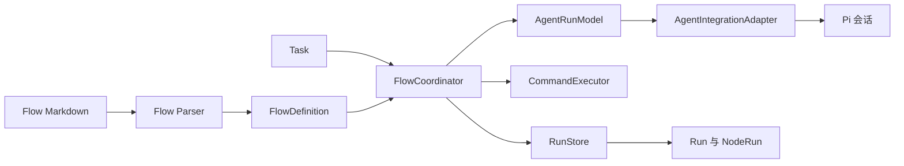
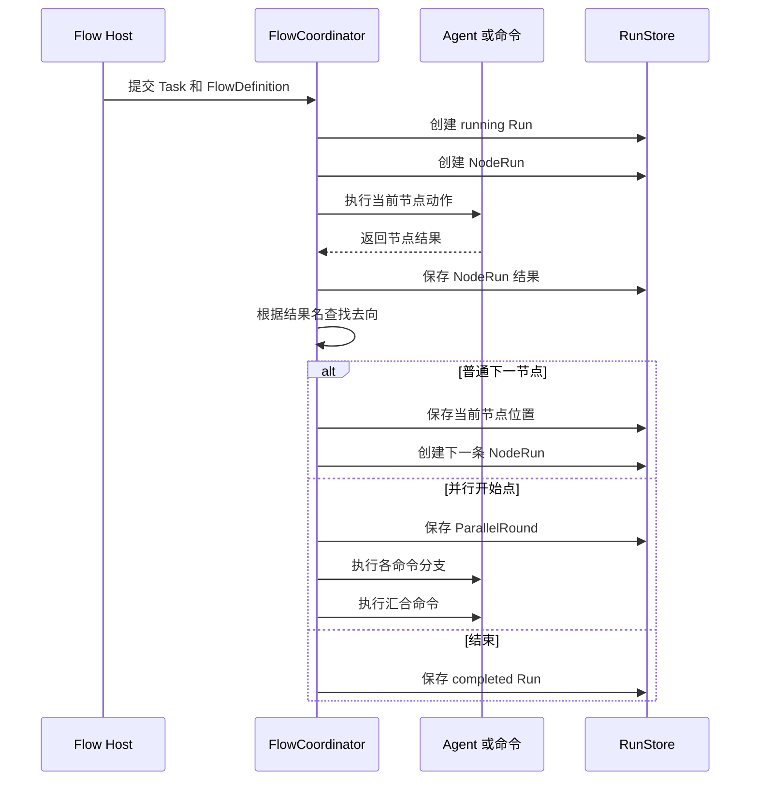

# Agent Flow Runtime 架构设计

## 1. 架构边界

Agent Flow Runtime 执行 Flow，不生成 Flow，也不替用户决定具体任务目标。

```text
Task    外部提供的具体任务
Flow    Markdown 描述的可复用工作路径
Runtime 把 Task 放入 Flow 并沿结果边执行
Pi      Runtime 使用的一种 Agent 宿主
```

Runtime 的核心职责是维护一次 Run 的状态，执行当前节点，接受节点结果，并按 Flow 定义选择下一去向。

## 2. 核心对象

### FlowDefinition

由解析器从 Markdown 生成的静态 Flow 定义，包含：

- 工作节点和节点动作。
- 节点允许的结果及其去向。
- 并行开始点、分支和汇合节点。

解析完成后，单次进程中的 Runtime 只使用这个结构化定义，不在执行过程中重新解释 Markdown。跨进程恢复时，宿主需要重新加载对应的 Flow 文件；因此要保证历史可复现，Run 还需要保存 Flow 版本。

### FlowRunRecord

一次具体 Task 的运行状态，包含：

- 使用的 Flow 标识和开始任务。
- 当前状态。
- 当前节点，或当前并行轮次。
- 开始和结束时间。
- 流程级错误。

它表示“现在走到哪里”。

### NodeRunRecord

一次实际进入节点的记录，包含：

- 所属 Run 和节点引用。
- 本次节点输入。
- 节点结果。
- 开始和结束时间。
- Agent 会话或命令执行依据。

它表示“这次经过了什么”。同一节点被返工多次时，每次进入都会产生新的 NodeRunRecord。

### ParallelRoundRecord

一次并行开始点的执行记录，包含进入并行点时的输入和各分支 NodeRun 的关联。它保证汇合节点读取的是同一轮的分支结果。

## 3. 模块关系



### Flow Parser

负责读取和校验 Flow 文件，生成可信的`FlowDefinition`。

它不执行动作，不创建 Agent，也不保存 Run 状态。

### FlowCoordinator

负责一次 Run 的全部流程状态，是唯一的状态所有者：

- 创建和更新 Run。
- 创建和完成 NodeRun。
- 调用 Agent 或命令执行当前节点。
- 校验节点结果并决定下一去向。
- 创建并行轮次，等待分支并执行汇合。
- 在完成或失败时结束 Run。

它不直接操作 Pi，也不依赖某个 Agent 平台的对象。

### AgentRunModel

负责 Run 级别的 Agent 绑定。它把“新建 Agent”“复用 Agent”“接管 Agent”和“释放 Agent”统一成运行时接口，并将 Agent 节点结果返回给协调器。

它不解析 Flow，也不选择下一节点。

### AgentIntegrationAdapter

负责接入具体 Agent 平台：创建或恢复会话、注入节点提示、接收结构化结果、读取节点交互和释放会话。

适配器只能通过统一接口与协调器间接协作，不保存流程状态。

### CommandExecutor

负责执行 Flow 中的自定义命令，返回退出码、标准输出和标准错误。它不解释业务含义。

### RunStore

负责保存和查询 Run、NodeRun、RouteDecision、ParallelRound 及执行序号/版本。一次状态变化必须原子保存所有关联事实，保存成功后才允许发布观测事件；它不决定流程路径。

## 4. 一次 Run 如何推进



每个节点只返回一个结果。结果名用于选择边，结果内容作为后续节点输入。结果被接受后，协调器才会推进流程。

如果节点执行、结果校验或路径查找失败，关联 NodeRun 和 Run 都必须进入显式失败状态，并保留错误分类与摘要。进程中断先将 Run 和未完成 NodeRun 记录为`interrupted`；Agent 恢复必须创建新的 NodeRun 并关联旧记录，未完成命令不得自动重放，恢复时进入有明确原因的`failed`或等待人工处理的`interrupted`。命令正常退出但退出码非零属于已完成命令节点的业务结果，仍可继续路由。

## 5. Agent 执行边界

Agent 节点的执行分为三层：

```text
FlowCoordinator
    调用 AgentRunModel 执行节点

AgentRunModel
    管理 Run 与 Agent 的绑定
    校验节点结果

AgentIntegrationAdapter
    操作具体 Agent 会话和消息
```

Agent 只能通过`submit_flow_outcome`提交结果。结果名必须属于当前节点，且一个节点只能接受一次有效提交。Agent 的自然语言内容是结果内容和执行依据，不是流程控制指令。

一个 Agent 会话同一时间只能执行一个节点，并且只能绑定一个 Run。`新建Agent`替换当前 Run 的绑定，`复用Agent`继续该绑定。

## 6. 并行边界

并行只属于一次 Run，不改变 Flow 的静态结构。进入并行开始点时：

1. 创建一个新的 ParallelRoundRecord。
2. 保存本轮共同输入。
3. 为每个直接分支创建独立 NodeRun。
4. 等待所有分支完成。
5. 用本轮输入和本轮分支结果执行汇合节点。

分支结果必须按分支节点引用关联，不能按完成时间或历史上最近的结果推断。重新进入并行开始点时，必须创建新的轮次。

## 7. 执行路径观测

Runtime 的观测对象就是 Run 和 NodeRun，不需要另建一套流程模型。

```text
Flow 标识
  -> Run 当前状态和当前位置
  -> NodeRun 按执行顺序排列的历史
  -> 每个节点的结果和执行依据
```

它应支持还原以下信息：

- 这次 Task 使用了哪条 Flow。
- 当前在哪个节点或并行轮次。
- 已经经过哪些节点。
- 为什么从一个节点进入下一个节点。
- 哪次访问产生了返工、失败或等待。

TUI、CLI 查询、JSONL 事件或后续指标系统都只是这份运行事实的不同读取方式。它们不能修改 Run，也不能选择结果或下一节点。

运行事实如何产生、如何推送到 TUI/CLI/JSON/RPC，以及断线和恢复语义见[Flow 运行观测设计](flow-observability-design.md)。

## 8. 数据保存

运行事实层现在由`InMemoryRunStore`和`JsonFileRunStore`保存 Run、NodeRun、RouteDecision、ParallelRound、恢复记录和版本水位。旧 JSON 记录会被兼容读取并标记为`legacy`，不能伪造缺失历史。JSON Store 仅用于 MVP 的单进程单实例本地运行记录，采用串行写入和临时文件原子替换，不作为高并发分析数据库、跨进程协调器或事件日志。

运行时应区分三类数据：

- **流程状态**：Run 当前状态、当前位置和终态。
- **执行历史**：NodeRun、并行轮次、结果和错误。
- **执行依据**：Pi 交互引用、命令退出状态及输出。

执行依据可能包含任务正文、源码或敏感信息。展示和导出时应优先使用摘要和引用，完整内容由对应宿主按权限读取。

Run 创建时必须保存 Flow 内容版本或稳定指纹，否则恢复和历史查询不得声称能够复现当时的 Flow。Task 仍属于 Run 的输入快照或稳定引用，不得写入 Flow 定义。

## 9. 必须保持的规则

- Task 是具体任务，Flow 是可复用路径，Run 是一次执行实例。
- Flow Parser 只解析和校验，不执行动作。
- FlowCoordinator 是 Run 状态、流程位置和 NodeRun 的唯一写入者。
- 每次进入节点都创建独立 NodeRun，不能覆盖循环或返工历史。
- 结果名决定去向，结果内容传给后续节点。
- Agent 适配器不读取 Flow 图，不选择流程去向。
- 并行分支和汇合结果必须属于同一个并行轮次。
- 观测只能读取和解释执行事实，不能反向控制流程。

## 10. 当前实现范围

当前实现包含 Flow 解析、普通节点流转、Agent 新建和复用、命令执行、单层命令并行、显式汇合、Pi 会话关联、本地运行记录，以及 Pi CLI 恢复执行中的 Run。

当前运行记录查询仍直接通过`RunStore`接口提供，扩展层主要在流程结束或失败时通知用户，尚未实现本契约要求的统一 Runtime 入口、FlowRunInspector、FlowObservationPublisher、快照水位协议和持续进度展示。它们是下一阶段的实现范围，不应在各展示端重复拼接历史。