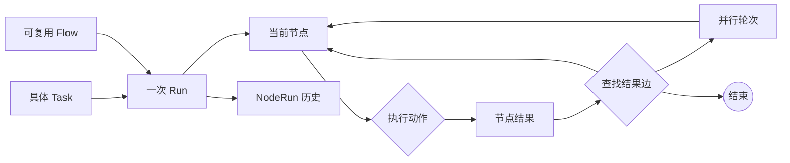
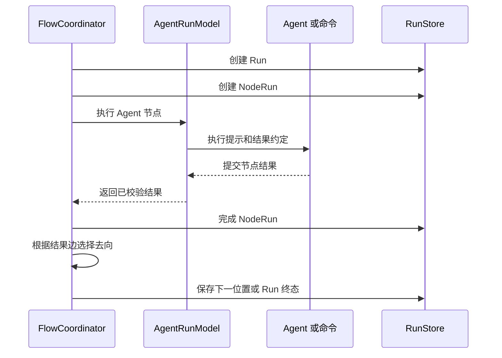

# Agent Flow Runtime 总体设计

## 1. 定位

Agent Flow Runtime 负责把一个具体任务交给一条可复用的 Flow，并按照 Flow 的节点和结果边推动执行。

它解决的问题不是替用户定义目标，而是把已经定义好的工作路径稳定地执行出来：节点交给 Agent 或命令完成，结果决定路径继续、返工、并行或结束，运行记录保留这次执行经过的节点和依据。

## 2. 基本模型

```text
Task     具体任务和输入
Flow     可复用的工作路径
Run      Task 按 Flow 执行的一次实例
NodeRun  Run 实际进入某个节点的一次访问
```

Flow 是静态定义，Run 是动态状态，NodeRun 是执行历史。三者不能互相替代：

- Flow 不保存某次任务的状态。
- Run 不改变 Flow 的路径定义。
- NodeRun 不代表新的 Flow 节点，只代表一次实际访问。



运行开始时在内存中加载 Flow 定义。单次进程内不会重新解释文件；当前跨进程恢复会重新读取 Flow 文件，因此已使用的 Flow 文件应保持不变。后续应为 Run 保存 Flow 版本，保证恢复时仍能使用原定义。

## 3. 一次 Run 的执行

一次 Run 从首个工作节点开始：

1. 使用 Task 作为首个节点输入。
2. 创建一条 NodeRun，执行该节点的一个动作。
3. 接收一个经过校验的节点结果。
4. 根据“节点引用 + 结果名”查找下一去向。
5. 将结果内容传给下一个节点，或执行并行轮次，或结束 Run。

普通节点的结果内容是下一节点的输入。节点动作代码块中的`{outcome}`始终表示当前输入。

一个 Agent 节点只能通过`submit_flow_outcome`提交一次结果，并且结果名必须属于该节点声明的结果。命令节点固定提交`已执行`，命令成功或失败由结果内容表达，后续 Agent 节点负责业务判断。



## 4. 并行执行

并行开始点是 Flow 中的路径控制点，不是一个工作节点。运行时进入并行点时创建一个并行轮次，保存当前输入，并把同一输入交给多个命令分支。

所有分支完成后，运行时执行汇合命令。汇合命令使用本轮开始时的输入和本轮各分支的结果，不能读取其他轮次的结果。汇合结果再交给后续节点。

并行分支只允许命令动作，Agent 仍由统一 Agent 运行模型串行使用。重新进入并行点会创建新的轮次，每个分支都产生新的 NodeRun。

## 5. 模块职责

### Flow 解析器

读取 Markdown，生成经过结构检查的`FlowDefinition`。它只理解 Flow 格式，不执行 Agent、命令或运行状态。

### FlowCoordinator

拥有一次 Run 的动态状态，是流程状态和 NodeRun 的唯一写入者。它负责：

- 创建 Run 和 NodeRun。
- 选择并执行当前节点动作。
- 校验结果并查找下一去向。
- 管理并行轮次和汇合输入。
- 保存完成或失败状态。

它不直接操作 Pi 会话，也不理解具体 Agent 平台。

### AgentRunModel

按 Run 管理 Agent 绑定，统一处理新建、复用、接管和释放。它向协调器返回统一的节点结果和会话引用。

### AgentIntegrationAdapter

负责具体 Agent 平台的会话、提示注入、结果工具和交互读取。适配器不读取 Flow 图，不选择结果去向，也不修改 Run。

### CommandExecutor

执行命令并返回退出状态、标准输出和标准错误。它不判断业务结果。

### RunStore

保存 Run、NodeRun 和并行轮次关联，并提供查询。它不参与流程解释和路径选择。

## 6. 执行路径观测

观测不是另一套流程控制系统。它只是把 Run 的当前状态和 NodeRun 历史展示出来，让人能够回答：

```text
这项任务使用了哪条 Flow？
当前走到哪个节点？
之前经过了哪些节点？
为什么进入当前节点？
哪个节点失败、返工或等待？
```

因此，最小观测能力是：

- Run 当前状态和当前位置。
- 按顺序排列的 NodeRun 执行路径。
- 每次节点的结果、耗时、错误和执行依据。
- 并行轮次的分支状态和汇合结果。

指标、日志平台和 Trace 只是这些运行事实的不同展示方式，不改变协调器的路由，也不成为 Flow 文件的一部分。

## 7. 必须保持的规则

- Task 是本次具体输入，Flow 是可复用路径，不能混为一谈。
- 单次进程内 Run 使用同一份已解析的 Flow 定义；跨进程恢复必须使用与原 Run 相同的 Flow 版本。
- 每次进入节点都创建独立 NodeRun；循环和返工不能覆盖历史记录。
- 结果名决定去向，结果内容作为后续节点输入。
- 只有协调器可以改变 Run 状态和流程位置。
- Agent 只能通过受校验的结果提交回到流程运行时。
- 并行分支和汇合结果必须属于同一个并行轮次。
- 观测只能读取和解释执行事实，不能替流程选择路径。

## 8. MVP 范围

MVP 包含 Flow 解析、Task 到 Run 的启动、三种节点动作、结果驱动流转、单层命令并行、显式汇合、Agent 会话关联和 NodeRun 记录。Flow 复用来自 Markdown 文件；Pi 只是其中一个 Agent 宿主，不改变通用 Flow 格式。

详细模块边界见[Agent Flow Runtime 架构设计](agent-flow-runtime-architecture.md)。