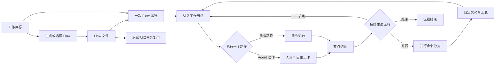
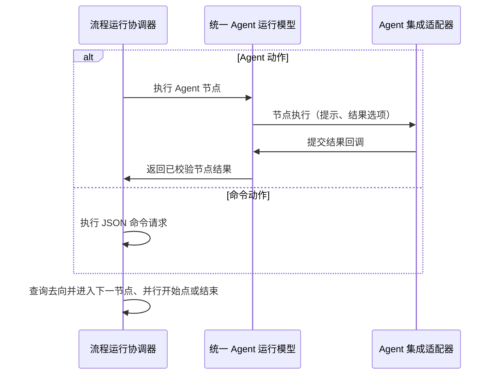

# Agent Flow Runtime 总体设计

## 1. 要解决什么

长任务既需要一条能复用的工作路径，也需要根据新信息自由判断。Agent Flow Runtime 将 Flow 和一次具体任务结合，让路径、门禁和返工保持稳定，同时将具体工作交给 Agent 或命令执行。

## 2. Flow 与一次运行

Flow 是通用的 Markdown 工作方法文件，定义节点、结果边、动作和并行关系。一次 Flow 运行持有具体任务和节点记录。普通执行时，它持有当前节点和输入；并行执行时，它持有本轮分支的执行状态和共同输入。统一 Agent 运行模型按运行标识维护 Agent 绑定。

Flow 文件的通用定义见[Flow 概览](flow-overview.md)和[Flow 规范](flow-spec.md)。Runtime 使用该规范，不将特定 Agent 平台的接入方式写入 Flow。

## 3. 节点如何执行

每个工作节点统一为“动作 + 参数”。MVP 有三种动作：新建Agent、复用Agent、执行自定义命令。一个节点只执行一个动作，节点之间通过结果传递信息。

`{outcome}`表示当前节点收到的输入。首个节点使用流程开始任务，普通后续节点使用上一个节点的结果内容。Agent 动作从当前节点允许的结果中选择一个提交；命令动作固定提交`已执行`，并在结果内容中保留执行状态。结果名负责图中的流转，结果内容负责把当前工作带到下一节点。

流程协调器通过统一 Agent 运行模型执行 Agent 动作。模型只维护运行级 Agent 绑定和通用契约，并通过由具体平台实现的`AgentIntegrationAdapter`接入 Agent。该接口包含`新建Agent`、`接管Agent`、`节点执行`、`查询节点会话`和`解除绑定`。适配器通过`节点执行`请求中的提交结果回调回传节点结果，模型校验后才将结果交给协调器。新建动作创建该运行的 Agent，复用动作继续该运行已绑定的 Agent。一个 Agent 实例同一时间只服务一个运行；流程结束时解除绑定，节点记录保留会话引用，已有会话继续由所属 Agent 平台管理。

## 4. 并行、汇合与记录

并行开始点启动一轮并行执行，保存到达该点的输入，并复制给多个独立命令节点。每个分支都形成自己的节点记录，Agent 保持串行使用。

汇合节点是普通的自定义命令节点。它的`{outcome}`使用本轮并行输入，并通过`{节点引用名.outcome}`读取当前轮次直接分支的完整结果。汇合命令明确怎样组合这些结果，输出成为下一节点的`{outcome}`。后续 Agent 再进行需要专业判断的流转。

每次进入工作节点都会新建一条节点运行记录，关联 Flow 标识、节点引用名、节点输入、结果名、结果内容和 Agent 交互引用。查看一个 Flow 时，可以按 Flow 标识列出它的运行历史；查看一次运行时，可以按节点还原执行路径。

## 5. 生成和复用

Agent 根据工作目标生成 Flow 文件：先补充名称和适用情况，再画出少量工作节点、结果、门禁、返工边和必要的并行检查，最后为每个工作节点写出一个动作代码块和结果说明。专家经验沉淀在适用情况、路径、动作参数和结果说明中。

后续相似任务可根据`description`选择已有 Flow。已被运行使用的 Flow 文件保持固定。需要调整时新建 Flow 文件。Flow 目录可以按文件名展示每个 Flow 被哪些运行使用。

## 6. MVP 的范围

MVP 完成 Flow 生成、三种节点动作、结果驱动流转、单层命令并行、显式汇合、节点运行记录和 Flow 复用。先验证 Agent 与命令能否沿同一流程稳定协作，以及门禁、返工和独立检查能否保持长任务方向。

详细模块边界见[Agent Flow Runtime 架构设计](agent-flow-runtime-architecture.md)。
