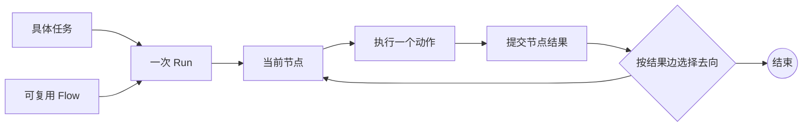
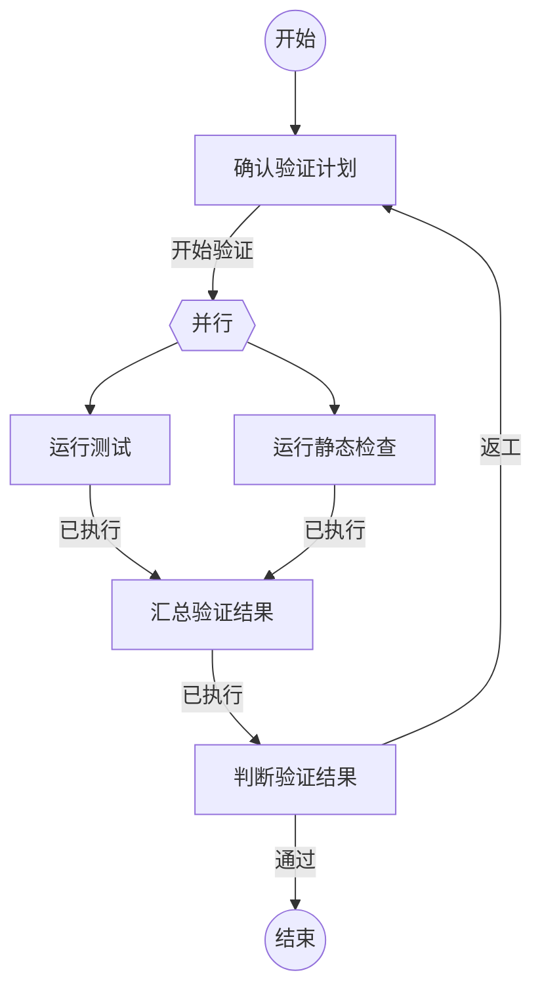

# Flow 概览

Flow 是一条可复用的工作路径。它把一类任务通常要经过的工作节点、判断结果、返工路径和必要的并行检查写成 Markdown。Flow 不保存某次任务的临时状态，也不替某次任务设定具体目标。

精确的文件格式见[Flow 规范](flow-spec.md)。

当一条工作路径需要随包提供参考资料或脚本时，目录组织约定见[Flow 规范](flow-spec.md)中的“Flow 包目录”章节。当前运行时只执行单文件 V1 Flow。

## 四个概念

```text
Task     这次要解决的具体问题
Flow     处理这类问题可以复用的工作路径
Run      某个 Task 按某个 Flow 执行的一次实例
NodeRun  这次 Run 实际访问某个节点的一次记录
```

例如：

```text
Task：修复登录超时问题
Flow：代码修改与验证
Run：本次修复任务沿该 Flow 执行的过程
NodeRun：分析、修改、验证和返工节点的每次实际访问
```

一次 Run 在单次进程内使用启动时加载的 Flow 定义。当前恢复运行时会重新读取 Flow 文件，因此 Flow 文件应作为固定工作方法维护；后续应为 Run 保存 Flow 版本，保证跨进程恢复时仍使用原定义。

## Flow 文件

每个 Flow 文件包含四部分：

| 部分 | 作用 |
| --- | --- |
| 元信息 | 说明这条路径的名称和适用情况 |
| Mermaid 图 | 定义节点、结果去向、循环和并行关系 |
| 节点动作区 | 定义每个节点执行一个 Agent 或命令动作 |
| 结果说明 | 解释节点结果代表什么 |

文件名是 Flow 的标识，供目录发现和运行记录关联。文件本身只描述通用路径，不包含某次任务的输入、执行结果或 Agent 会话。

## Run 如何沿路径执行

运行时把具体 Task 交给 Flow 的首个节点。节点完成后提交一个结果，运行时根据该节点的结果边选择下一步。



节点输入沿路径传递：首个节点收到 Task，普通后续节点收到上一个节点的结果内容。动作代码块中的`{outcome}`表示当前节点收到的输入。

每次进入节点都会创建一条 NodeRun。返工再次访问同一个节点时，会产生新的 NodeRun，不会覆盖上一次记录。

## 节点动作和结果

一个节点只执行一个动作：

- `新建Agent`：为当前 Run 创建一个新的 Agent。
- `复用Agent`：继续使用当前 Run 已绑定的 Agent。
- `执行自定义命令`：执行 Flow 中定义的 JSON 命令。

Agent 节点从该节点声明的结果中选择一个并提交。命令节点固定提交`已执行`，命令成功或失败由结果内容表达，后续 Agent 节点可以根据命令结果作出判断。

命令节点负责执行，不负责判断业务结果。结果名负责选择路径，结果内容负责向后传递信息。

## 并行与返工

并行开始点表示同一条 Flow 路径中的一次并行检查。运行时进入并行点时创建一个并行轮次，保存当前输入，并把同一输入交给多个命令分支。



上例中，测试和静态检查是同一条 Flow 路径中的独立分支。汇合命令读取本轮分支结果，判断节点再决定结束还是返工。每次回到并行点都会启动新的轮次，不能混用上一轮的分支结果。

## 运行记录和执行依据

Run 记录当前状态和已经走过的路径。NodeRun 记录一次节点访问的输入、结果、时间和执行依据：

- Agent 节点关联 Pi 会话和本次交互范围。
- 命令节点关联命令执行结果。
- 并行节点关联本轮的分支和汇合关系。

因此查看一次 Run 时，应能看到类似这样的路径：

```text
分析 -> 修改 -> 验证 -> 修改 -> 验证 -> 结束
                         ^
                         验证第一次未通过，回到修改
```

运行记录的作用是还原这次任务如何沿 Flow 执行，不是修改 Flow，也不是替 Agent 判断业务结论。

## Flow 的生成和复用

只有当一类任务会重复经过相似的工作阶段，并且路径中的判断或返工值得固化时，才适合生成 Flow。生成后，先根据`description`选择适用的 Flow，再把具体 Task 作为本次 Run 的输入。

工作方法发生变化时创建新的 Flow 文件。已经开始的 Run 继续使用原来的 Flow 定义。

## 继续阅读

- 编写或校验 Flow 文件时，阅读[Flow 规范](flow-spec.md)。
- 了解运行时模块边界，阅读[Agent Flow Runtime 架构设计](agent-flow-runtime-architecture.md)。