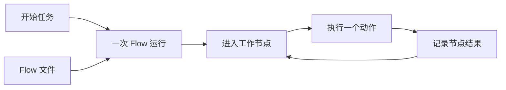
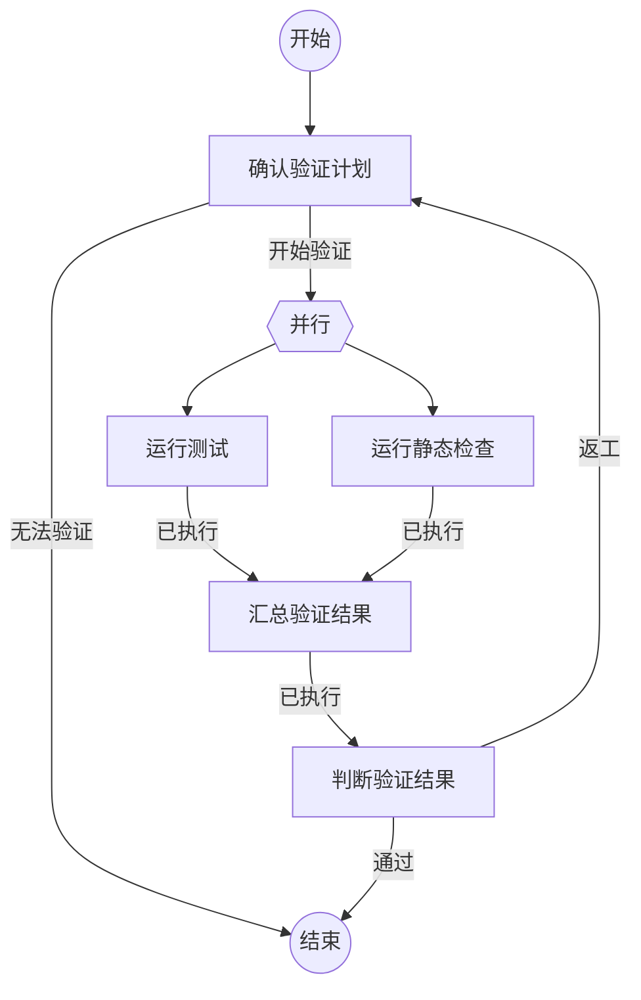

# Flow 概览

Flow 文件把可复用的工作方法写成 Markdown。它为长任务提供路径、门禁、返工和独立检查，将节点中的具体工作交给 Agent 或命令执行。

Flow 适用于需要经过多个阶段、存在判断或返工，并希望沉淀有效工作方法的任务。精确格式见[Flow 规范](flow-spec.md)。

## 文件由什么组成

每个 Flow 文件包含四部分：

| 部分 | 作用 |
| --- | --- |
| 元信息 | 名称和适用情况，帮助人和 Agent 发现流程 |
| Mermaid 图 | 工作节点、结果去向、循环和并行开始点 |
| 节点动作区 | 当前节点的一个 Agent 或命令动作 |
| 结果说明 | 每个结果代表什么，帮助 Agent 选择去向 |

文件名是 Flow 标识，用于关联运行记录。文件开头只保留`name`和`description`；具体路径由 Mermaid 图决定。

## 一次 Flow 运行

Flow 文件描述固定的工作方法。一次 Flow 运行记录这次任务如何沿该方法展开：开始任务、当前工作节点及其输入，或当前并行轮次，以及每次节点执行的结果。

节点之间沿结果边传递结果内容。首个节点收到开始任务，普通后续节点收到上一个节点的结果内容。代码块中的`{outcome}`始终表示当前节点收到的输入。



每次进入节点都会留下独立记录。因此节点在返工中再次执行，或命令在并行分支中执行，都会与该次运行和该节点清楚关联。

## 节点怎样运行

一个工作节点只执行一个动作：新建Agent、复用Agent或执行自定义命令。Agent 在节点允许的结果中自主选择结果；命令固定提交`已执行`，并把执行状态写入结果内容。

```mermaid
flowchart LR
  input[节点输入] --> action[一个节点动作]
  action --> result[节点结果]
  result --> route{结果边}
  route --> next[下一节点]
  route --> end[结束]
```

命令节点不表达业务判断。后续 Agent 节点依据命令结果中的执行状态和输出选择流程分支。

## 并行与汇合

Mermaid 图中的`{{并行}}`启动一次并行轮次。它保存收到的输入，并将同一份输入复制给多个独立命令节点。并行区只运行命令，Agent 始终串行使用。

汇合是一个普通的自定义命令节点。它有多个入边，只有在本轮所有分支完成后才执行。汇合节点的`{outcome}`是进入并行开始点时保存的输入；它通过`{节点引用名.outcome}`读取各个直接分支的完整结果，并在命令中明确怎样筛选、拼接或转换这些结果。



上例中，测试和静态检查都基于同一份验证任务运行。`汇总验证结果`读取`{test.outcome}`和`{lint.outcome}`，生成新的结果内容；`判断验证结果`再根据该内容决定结束或返工。

## Agent 与记录

统一 Agent 运行模型按 Flow 运行标识维护 Agent 绑定。运行可以从一个已有 Agent 开始，也可以从空状态开始。`新建Agent`创建新的 Agent，`复用Agent`继续该运行已绑定的 Agent。一个 Agent 实例同一时间只服务一个 Flow 运行；流程结束时解除绑定，已有会话仍由所属 Agent 平台继续管理。每次 Agent 交互的会话引用保留在对应节点记录中。

运行记录按 Flow 标识查询。查看一个 Flow 时，可以列出它的运行记录；查看一次运行时，可以按节点还原任务的执行路径、结果和 Agent 交互。

## 生成和复用

Agent 可以根据工作目标生成 Flow 文件：先说明适用情况，再画出少量工作节点、结果边、门禁和返工边，最后为每个节点补充一个动作和结果说明。

相似任务先根据`description`选择已有 Flow。Flow 内容需要调整时新建文件，已使用的 Flow 文件保持原样。

## 继续阅读

- 编写或校验 Flow 文件时，阅读[Flow 规范](flow-spec.md)。
