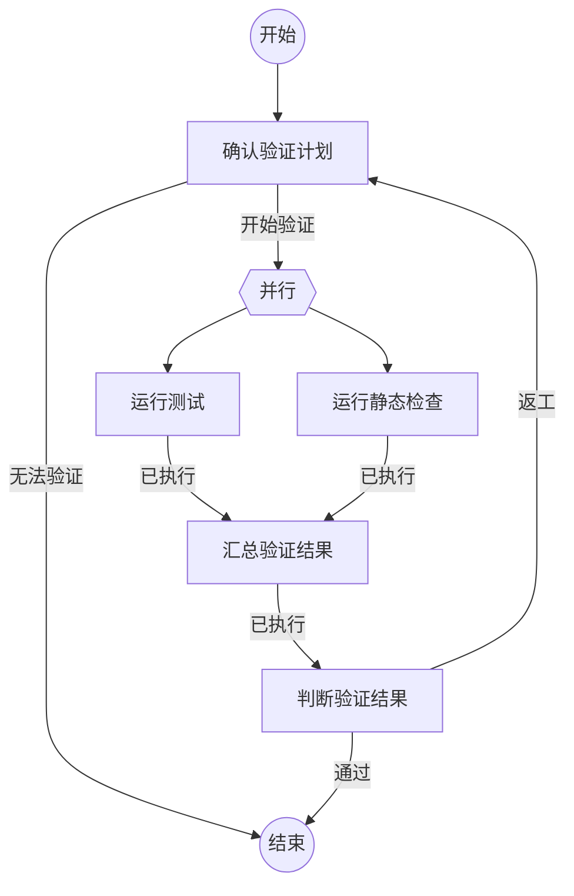

# Flow 规范

本规范定义可运行 Flow 文件的格式。Flow 的用途和整体方式见[Flow 概览](flow-overview.md)。

## 1. 文件开头

文件以元信息开头，只保留流程名称和适用情况：

```markdown
---
name: 代码修改与验证
description: 适用于目标明确、需要完成代码修改并运行测试验证的任务。
---
```

`name`和`description`均为非空内容。`name`供人展示，`description`供 Flow 目录和 Agent 发现、选择与复用 Flow。文件名去掉`.md`后是 Flow 标识，用于关联运行记录。

## 2. 图与节点

文件恰有一张`flowchart TD`。

- 开始固定写为`start((开始))`，只有一条去向。
- 结束固定写为`finish((结束))`，不再连向其他节点。
- 工作节点写为`节点引用名[节点名称]`。节点引用名和节点名称在同一 Flow 中唯一，节点名称与同名二级标题对应。
- 并行开始点写为`引用名{{并行}}`。它只控制图中的流转，不对应二级标题或动作。
- 工作节点的结果边写为`节点引用名 -->|结果名| 下一节点`。
- 并行开始点的出边省略结果文字，表示同时启动多个分支。

例如：



`plan[确认验证计划]`对应`## 确认验证计划`。`plan`用于连线和记录，节点名称直接表达当前工作。

每条工作节点的结果边在所属节点下都有一个同名三级标题。结果名只在发出它的节点内唯一，解释器以“节点引用名 + 结果名”查找下一节点。

只有一个结果边的工作节点实现固定流转。Agent 节点可以声明多个结果边，用于门禁和循环。

## 3. 节点动作

节点的动作区位于二级标题之后、第一个三级结果标题之前。一个动作区只包含一个非空动作代码块。

动作代码块使用以下标记：

- `新建Agent`：创建一个 Agent，并将它绑定到本次 Flow 运行。
- `复用Agent`：继续本次 Flow 运行已绑定的 Agent。
- `执行自定义命令`：执行代码块中的 JSON 命令请求。

Agent 动作的代码块内容是引导提示。自定义命令的代码块必须是一个 JSON 对象：

```json
{
  "command": "node",
  "args": ["scripts/check.js"],
  "stdin": { "task": "{outcome}" }
}
```

`command`是当前执行环境中的命令名或路径。`args`是可选的字符串数组。`stdin`是可选的 JSON 值，运行模型以 UTF-8 JSON 写入命令的标准输入。命令进程的工作目录是本次 Flow 运行指定的`cwd`；未指定时继承宿主进程的工作目录。

````markdown
## 确认验证计划

```新建Agent
确认以下任务是否具备开始验证的条件：
{outcome}
```

### 开始验证

已经具备运行验证所需的条件。

### 无法验证

缺少会影响验证方向的关键信息。
````

## 4. 输入与结果引用

一次 Flow 运行在节点之间传递输入。`{outcome}`只在动作代码块中出现时替换，其含义由节点进入方式确定：

| 节点进入方式 | `{outcome}` |
| --- | --- |
| 首个工作节点 | 流程开始任务 |
| 普通结果边 | 上一个节点的结果内容 |
| 并行分支 | 进入并行开始点时收到的输入 |
| 汇合节点 | 进入并行开始点时收到的输入 |

并行开始点启动时，运行时将该输入保存为本轮并行输入。每个直接分支和对应的汇合节点都使用这份输入。因此分支完成顺序不会影响汇合节点的`{outcome}`。

汇合节点还可以在其自定义命令的`stdin`中引用直接分支结果：`{节点引用名.outcome}`。此引用只能作为一个独立 JSON 值出现，运行时会替换为对应分支的完整结果。它只能引用当前并行轮次、直接进入该汇合节点的分支；其他节点、其他代码块位置和其他节点引用均视为规范错误。

完整结果固定表示为 JSON：

```json
{
  "result": "已执行",
  "content": {
    "status": "failure",
    "exitCode": 1,
    "stdout": "命令标准输出",
    "stderr": "命令标准错误"
  }
}
```

运行时先替换代码块中的引用，再解析自定义命令 JSON。自定义命令中的`{outcome}`必须出现在 JSON 字符串中，并按 JSON 字符串内容转义。`{节点引用名.outcome}`在`stdin`中作为独立 JSON 值出现，例如`"test": {test.outcome}`。循环再次进入并行开始点时，引用读取新一轮对应分支的结果，不读取历史轮次。

节点内只有一个动作，因此不存在动作之间的结果传递。跨节点数据依赖通过结果边和命名引用直接写在流程文件中。

````markdown
## 汇总验证结果

```执行自定义命令
{
  "command": "node",
  "args": ["scripts/merge-verification-results.js"],
  "stdin": {
    "task": "{outcome}",
    "test": {test.outcome},
    "lint": {lint.outcome}
  }
}
```

### 已执行

已生成可供判断的验证结果汇总。
````

汇总命令的输出是`汇总验证结果`节点的结果内容。下一节点通过`{outcome}`接收它。

## 5. 节点结果与 Agent

每个工作节点只提交一次“结果名 + 结果内容”。结果内容成为普通下一节点的`{outcome}`。

Agent 动作结束时，运行模型把当前节点允许提交的结果名和结果说明提供给 Agent。Agent 从中提交一个结果名和结果内容。运行模型只接受当前节点声明的结果名。

命令动作结束时，运行模型提交`已执行`。结果内容固定包含`status`、`exitCode`、`stdout`和`stderr`。退出码为`0`时`status`为`success`，其他退出码对应`failure`。命令节点不依据这些状态选择结果边，后续 Agent 可以依据结果内容作出业务判断。

一次 Flow 运行开始时，可以带入一个已有 Agent 引用，也可以从空状态开始。统一 Agent 运行模型以运行标识维护该运行的 Agent 绑定。当前绑定为空时，首个 Agent 动作必须是`新建Agent`。`新建Agent`更新该运行的绑定，`复用Agent`继续该绑定。一个 Agent 实例同一时间只能绑定一个 Flow 运行；流程结束时解除绑定，已有会话仍由所属 Agent 平台管理。

## 6. 并行与汇合

并行开始点收到输入后启动一轮并行执行，为每个直接分支复制同一份输入。直接分支节点只有一条入边，且该入边来自所属并行开始点。V1 的并行分支只允许执行自定义命令。每个分支提交`已执行`并进入同一汇合节点，命令的执行状态保留在结果内容中。

一个汇合节点有两个或更多直接入边。这些来源节点必须恰好是同一个并行开始点的直接分支。汇合节点必须在`stdin`中引用每个来源节点的`{节点引用名.outcome}`。运行模型等待这些来源节点在同一轮并行执行中都到达汇合节点，再执行汇合命令。

V1 支持单层并行。汇合后的 Agent 节点依据分支结果决定继续、返工或结束；需要重试时回到并行开始点，启动新一轮分支执行。

## 7. 解释器检查

解释器检查以下内容：

- 元信息位于文件开头，且只含非空的`name`和`description`。
- 图中恰有一个开始和一个结束；所有工作节点从开始可达，并存在一条到结束的路径。
- 所有连线目标存在；每个工作节点有带结果文字的出边。
- 每个工作节点有同名二级标题；节点引用名和节点名称全局唯一。
- 二级标题到首个三级标题之间有一个非空动作代码块，标记精确为`新建Agent`、`复用Agent`或`执行自定义命令`。
- 自定义命令的代码块在引用替换后是 JSON 对象，包含非空的`command`；`args`存在时是字符串数组；`stdin`存在时是 JSON 值。
- 每条结果边有同名三级标题和非空说明。
- Agent 节点的结果名由结果边定义；命令节点只有`已执行`结果边。
- 并行开始点只有一条入边和两个或更多出边；直接分支节点只有来自所属并行开始点的一条入边，都是命令节点，且都以`已执行`进入同一汇合节点。
- 汇合节点有两个或更多直接入边，来源节点恰好是同一个并行开始点的直接分支；命名结果引用仅出现在该汇合节点的`stdin`中，且覆盖每个来源节点。

门禁是一个 Agent 节点的多条结果边。指回已有节点的结果边就是循环。解释器只检查结构，不判断 Agent 的专业结论。
