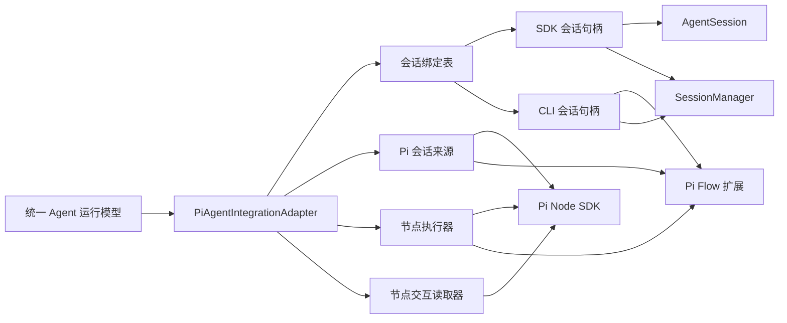
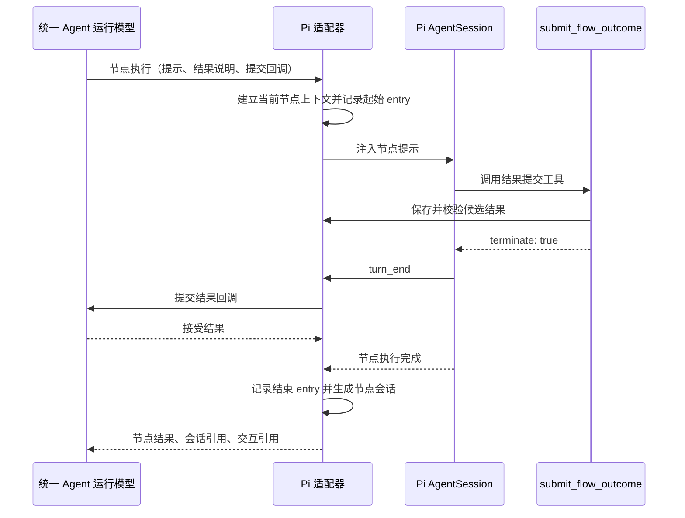
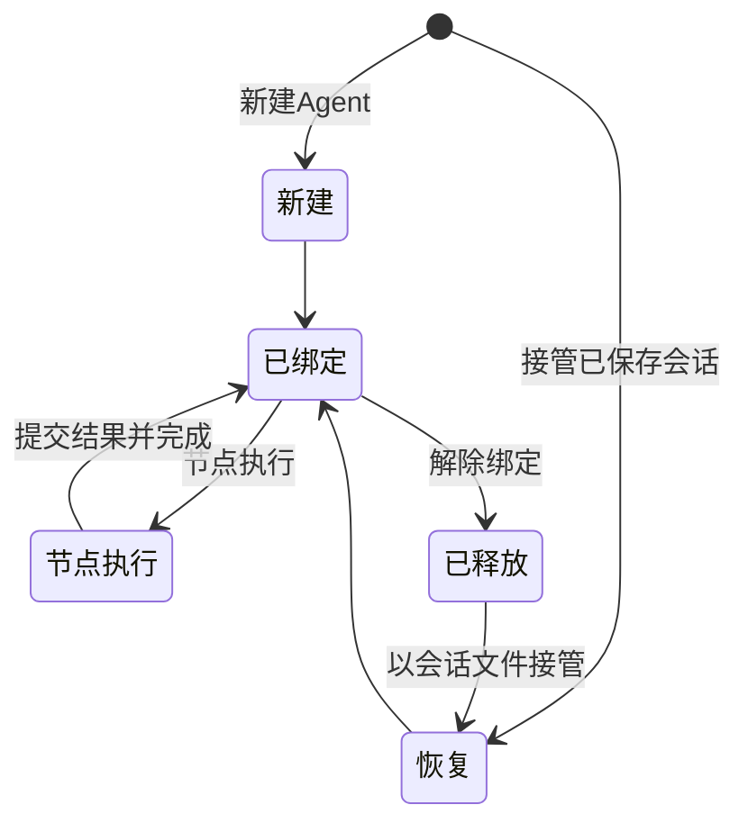

# Pi Agent 集成适配器实现设计

## 1. 定位

Pi Agent 集成适配器将[Agent Flow Runtime 架构设计](agent-flow-runtime-architecture.md)中的`AgentIntegrationAdapter`接入 Pi。它负责 Pi 会话、提示注入、结构化结果提交和交互记录读取，使 Flow 运行时始终通过统一 Agent 运行模型使用 Agent。Pi CLI 如何启动和承载 Flow 见[Pi Flow 启动入口设计](pi-flow-host-design.md)。

适配器覆盖以下职责：

- 创建 Pi 会话，或从已保存的 Pi 会话恢复运行。
- 将当前节点的已渲染提示和允许结果交给 Pi Agent 执行。
- 接收 Pi Agent 的结构化结果，并回调统一 Agent 运行模型。
- 将 Pi 会话中的节点交互映射为统一消息列表。
- 在 Flow 运行结束时解除会话绑定，保留可恢复的 Pi 会话记录。

Flow 解析、节点流转、结果去向和运行记录写入仍由 Agent Flow Runtime 负责。适配器只管理 Pi 侧的执行和交互。

## 2. 实现选择

适配器直接使用`@earendil-works/pi-coding-agent`的 Node SDK。它有两条会话执行路径：外部 Node 宿主创建的 SDK 会话，以及 Pi Flow 扩展绑定的当前 CLI 会话。

| Pi 能力 | 适配器用途 |
| --- | --- |
| `SessionManager` | 创建、打开和读取持久化 Pi 会话。 |
| `createAgentSession` | 构造可提示、可订阅、可释放的 Pi Agent 会话。 |
| `AgentSession.prompt()` | 注入一个节点任务，并等待该节点的 Pi 执行结束。 |
| `customTools` | 在会话创建时注册`submit_flow_outcome`结果提交工具。 |
| 会话 entries | 为节点记录提供稳定的交互范围和历史消息。 |

SDK 直接提供会话、工具和回调能力，适合在同一 Node 进程内实现适配器。MVP 的会话来源包括外部宿主新建的 Pi 会话、Pi CLI 当前会话，以及一个已保存的 Pi 会话文件。

已保存会话的恢复通过`SessionManager.open(sessionFile)`和`createAgentSession()`完成。恢复会构造新的内存会话，继续会话内容和工作目录。Pi CLI 当前会话由 Pi Flow 扩展在启动时直接交给适配器，节点提示和结果提交始终留在该会话内。

## 3. 与通用接口的对应关系

| 通用接口 | Pi 适配器实现 |
| --- | --- |
| `新建Agent` | 以运行提供的工作目录创建`SessionManager`，或将 Pi Flow 扩展提供的当前会话操作建立为新的 Flow Agent 绑定。 |
| `接管Agent` | 复用适配器中的活动会话、Pi CLI 当前会话操作，或根据 Pi 会话文件恢复新的`AgentSession`。 |
| `节点执行` | 设置当前节点上下文。SDK 路径调用`session.prompt()`，CLI 路径注入节点提示并等待 Pi 事件。 |
| `查询节点会话` | 用 Pi entries 的起止标识读取节点范围，转换为统一消息列表。 |
| `解除绑定` | 移除 Flow 运行对 Pi 会话的占用。SDK 路径释放运行资源并保留 JSONL 文件，CLI 路径保留 Pi TUI 会话。 |

`新建Agent`的工作目录、模型、工具集和会话目录来自 Flow 运行的启动配置。Flow 文件中的`新建Agent`动作仅表达“此节点需要一个新的 Agent”。

## 4. 模块组成



### 4.1 PiAgentIntegrationAdapter

适配器实现通用接口，并维护平台引用到 Pi 会话句柄的映射。它向统一 Agent 运行模型暴露不透明的 Agent 连接和节点会话引用，Pi 的对象只停留在适配器内部。

### 4.2 Pi 会话句柄

每个活动 Pi 会话对应一个句柄。SDK 会话句柄包含：

- 适配器生成的 Agent 连接引用。
- `AgentSession`和`SessionManager`。
- Pi `sessionId`、`sessionFile`和工作目录。
- 当前节点执行上下文。

CLI 会话句柄保存 Pi Flow 扩展 API、当前`SessionManager`、会话身份和当前节点执行上下文。扩展 API 负责注入节点提示、注册结果工具和订阅 Pi 事件，适配器不直接取得 Pi CLI 的`AgentSession`对象。

当前节点执行上下文只在`节点执行`期间存在，包含节点执行引用、允许结果、提交结果回调、候选结果和交互起始 entry 标识。一个 Pi 会话同一时间只允许一个节点执行。

`sessionFile`在 Pi 首次写入 assistant 消息后出现。新建会话在首个节点完成前可由活动句柄继续使用；节点完成后，适配器将已获得的会话文件写入节点会话引用，使后续恢复以该文件为准。

### 4.3 Pi 会话工厂

会话工厂负责三条会话来源路径：

- 新建路径：`SessionManager.create(cwd, sessionDir)`后调用`createAgentSession()`。
- 恢复路径：`SessionManager.open(sessionFile)`后调用`createAgentSession()`。
- CLI 绑定路径：接收 Pi Flow 扩展提供的会话操作和当前`SessionManager`，构造适配器会话句柄。

新建和恢复路径将`submit_flow_outcome`作为`customTools`传入`createAgentSession()`。CLI 绑定路径由 Pi Flow 扩展在会话创建前注册同名工具。三条路径都让结果提交工具读取对应会话句柄中的当前节点执行上下文，因此工具定义在会话创建时固定，节点的结果集合在每次执行时更新。

同一个会话文件在一个适配器实例中只对应一个活动句柄。这条约束保证 Pi 的 append-only JSONL 会话始终由单个 Pi 会话写入。

### 4.4 节点执行器

节点执行器接收统一 Agent 运行模型传来的节点请求。请求已经包含运行时解析后的引导提示和`{outcome}`输入，适配器只补充本节点的结果提交约定：

- 允许提交的结果名和结果说明。
- `submit_flow_outcome`工具的用途和参数。
- 将该工具作为完成节点的最后动作调用的要求。

Pi 在该提示下自行完成推理和工具调用。SDK 会话路径通过`prompt()`等待 Pi 的本次执行结束。CLI 会话路径通过 Pi Flow 扩展注入节点提示，在 Pi 的`turn_end`事件中确认结果工具已经完成并形成交互范围。两条路径都返回同一种节点结果和节点会话给统一 Agent 运行模型。

### 4.5 结果提交工具

每个 Pi 会话注册一个固定名称的`submit_flow_outcome`工具。工具输入只有两个字段：

- `outcome`：当前节点声明的结果名。
- `content`：结果内容，使用 Markdown 文本承载结论、证据和下一节点所需信息。

SDK 会话路径中，工具读取活动节点上下文、校验结果名，并将“节点执行引用、结果名、结果内容、会话引用和交互引用”传给`节点执行`请求中的提交结果回调。回调返回接受结果后，工具调用 Pi 的终止能力并以`terminate: true`结束本轮执行。

CLI 会话路径中，工具先保存候选结果并以`terminate: true`结束本轮执行。Pi Flow 扩展在`turn_end`事件中取得候选结果，完成交互范围记录后再调用提交结果回调。结果提交回调只确认本节点结果。后继节点由统一 Agent 运行模型在`节点执行`返回后交给流程运行协调器处理，下一节点提示以 Pi follow-up 消息排队。

一个节点上下文只接受第一次有效提交。提交工具设置为顺序执行，并在接受后中止当前 Pi 执行，保证本节点只形成一条结果提交事件。

## 5. 节点执行流程



这条流程将 Pi 的 ReAct 循环完整限制在一个节点内。结果工具是节点与流程之间唯一的控制出口，Mermaid 图解析和下一节点选择由 Agent Flow Runtime 承担。

## 6. 会话与节点记录关联

流程运行记录由协调器保存，Pi 适配器为每次 Agent 节点执行返回以下交互引用：

```text
Pi 节点会话引用
  Pi 会话标识
  Pi 会话文件
  起始 entry 标识
  结束 entry 标识
```

起始 entry 是注入节点提示前的 Pi 会话叶子。结束 entry 是 Pi 完成本节点后的叶子。查询节点交互时，读取结束 entry 所在分支，并提取起始 entry 之后直到结束 entry 的 entries，结束 entry 包含在范围内。Pi 的 user、assistant 和 tool result entries 映射为统一消息列表，原始 Pi entry 标识保留在消息引用中。

这种关联以节点执行为单位。循环再次进入同一 Flow 节点时，会创建新的节点记录和新的 entry 范围；同一 Pi 会话中的多轮工作仍可分别查询和还原。

## 7. 会话接管与释放



活动会话的接管直接复用适配器持有的句柄。已释放会话的接管以`sessionFile`恢复。会话文件是跨进程、跨适配器实例的恢复依据；适配器内部 Agent 连接引用只在当前实例中有效。

SDK 会话解除绑定时结束当前`AgentSession`的运行资源并调用`dispose()`，同时保留 Pi 生成的 JSONL 会话文件。CLI 会话解除绑定时只移除 Flow 绑定和节点上下文，Pi TUI 继续管理当前会话。运行记录中的节点会话引用保持可查询；后续 Flow 运行可携带该会话文件，恢复到新的 Pi 会话句柄。

## 8. 必须保持的规则

- Flow 解析、流程状态和节点去向由 Agent Flow Runtime 管理，Pi 适配器只处理 Pi 侧执行和交互。
- 一个 Pi Agent 会话同一时间只执行一个 Flow 节点，也只绑定一个 Flow 运行。
- 节点结果必须通过`submit_flow_outcome`提交，并属于当前节点允许的结果集合。
- 节点执行完成后，统一 Agent 运行模型才向协调器返回结果；结果回调不直接触发流程流转。
- 节点交互引用同时包含 Pi 会话身份和 entry 范围，后续会话消息通过新的 entry 范围与历史节点记录区分。
- SDK 会话解除绑定后保留可恢复的 Pi 会话文件。CLI 会话的生命周期继续由 Pi TUI 管理。

## 9. MVP 范围

MVP 支持 SDK 内嵌会话的新建与恢复、Pi CLI 当前会话绑定、单会话串行节点执行、结构化结果提交、节点交互查询和流程结束释放。Pi CLI 入口支持首个`新建Agent`和后续`复用Agent`的 Flow。模型选择、工具白名单、会话目录等运行环境配置由外部宿主或 Pi CLI 提供。

## 10. 实现依据

当前实现位于[运行时源码](../src)和[Pi 扩展入口](../src/extension.ts)。它使用公开 Pi SDK 和扩展 API；运行与节点记录默认保存在工作目录的`.pi/flow-runs.json`。

- [Pi SDK：AgentSession 与 SessionManager](https://github.com/earendil-works/pi/blob/main/packages/coding-agent/docs/sdk.md)
- [Pi RPC 模式说明](https://github.com/earendil-works/pi/blob/main/packages/coding-agent/docs/rpc.md)
- [Pi SDK 会话创建](https://github.com/earendil-works/pi/blob/main/packages/coding-agent/src/core/sdk.ts)
- [Pi 会话持久化与分支读取](https://github.com/earendil-works/pi/blob/main/packages/coding-agent/src/core/session-manager.ts)
- [Pi AgentSession 生命周期](https://github.com/earendil-works/pi/blob/main/packages/coding-agent/src/core/agent-session.ts)
- [Pi 结构化输出工具示例](https://github.com/earendil-works/pi/blob/main/packages/coding-agent/examples/extensions/structured-output.ts)
- [Pi 扩展能力](https://github.com/earendil-works/pi/blob/main/packages/coding-agent/docs/extensions.md)
- [Pi Flow 启动入口设计](pi-flow-host-design.md)
