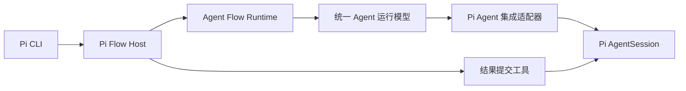
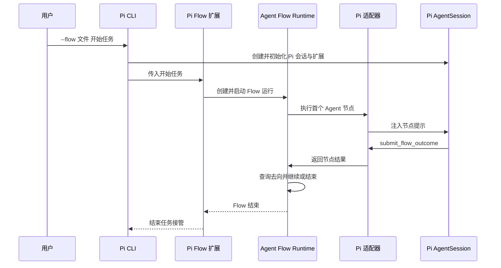

# Pi Flow 启动入口设计

## 1. 定位

Pi Flow 启动入口以 Pi 扩展的形式让用户在 Pi CLI 中直接运行指定 Flow。它复用 Agent Flow Runtime 的解释器、协调器和统一 Agent 运行模型，并将当前 Pi 会话交给[Pi Agent 集成适配器](pi-agent-integration-adapter-design.md)执行节点。

启动入口覆盖三种使用方式：

- 在 Pi TUI 启动时带入 Flow 和任务，边查看 Pi 的正常交互边执行 Flow。
- 在已打开的 Pi TUI 中通过`/flow run`启动一个 Flow。
- 以 Pi 的打印或 JSON 输出模式运行 Flow，等待流程结束后退出。

Flow 的文件格式和路径含义保持通用。Pi 只负责提供一个可交互、可持久化的 Agent 会话。

## 2. 用户入口

Flow 扩展注册`--flow <文件>`参数。Pi 在扩展加载后将该参数传给扩展，位置参数继续表示本次 Flow 的开始任务。

```powershell
# 在 Pi TUI 中运行 Flow
pi -e ./flow-extension.ts --flow ./.flows/code-change.md "修复当前项目的登录超时问题"

# 无头运行
pi -e ./flow-extension.ts --flow ./.flows/code-change.md -p "修复当前项目的登录超时问题"

# 无头运行，输出 Pi 的 JSONL 事件
pi -e ./flow-extension.ts --flow ./.flows/code-change.md --mode json -p "修复当前项目的登录超时问题"
```

扩展安装到 Pi 的全局或项目扩展目录后，命令可省略`-e`。TUI 中的`/flow run <文件> <任务>`使用当前 Pi 会话启动 Flow。运行期间，用户仍可查看 Pi 的推理、工具调用和消息，Flow Host 负责在节点结果提交后自动注入下一节点提示。

## 3. 核心选择

Flow Host 运行在 Pi 扩展进程中，通过扩展 API 驱动当前 Pi 会话。它在 Pi 的`input`事件中接住开始任务，启动并等待整次 Flow，因此 TUI、打印模式和 JSON 模式共享同一条执行路径。

扩展负责注册`submit_flow_outcome`工具、`/flow run`命令和 TUI 状态展示。开始任务被 Flow Host 接管后，原始 Pi 提示会持续等待，直到整个 Flow 完成，Pi 的打印模式因而会等待完整的多节点流程。



Pi Flow Host、结果提交工具和交互命令都属于同一个 Pi 扩展。它们共同使用当前 Pi 会话，Flow 的解释和流转始终由通用运行时处理。

## 4. 模块职责

### 4.1 Pi Flow Host

Pi Flow Host 位于 Pi 扩展中。

- 读取`--flow`、`/flow run`参数和开始任务，加载 Flow 并创建一次 Flow 运行。
- 在`input`事件中接管本次开始任务，使 Pi 不将它当作普通对话提示。
- 创建绑定当前会话的 Pi 适配器，启动并等待 Flow 完成。
- 节点结束后向 Pi 排队下一节点提示，继续使用同一条 Pi 提示生命周期。
- 放行扩展注入的节点提示，防止它们再次被识别为 Flow 开始任务。
- 在 TUI 中更新当前 Flow 和节点状态。

### 4.2 Pi Flow 扩展

扩展在 Pi 会话创建前加载。

- 注册`submit_flow_outcome`工具，供 Agent 提交“结果名 + 结果内容”。
- 注册`--flow`和`/flow run`，将当前 Pi 会话和指定任务交给 Pi Flow Host。
- 在 TUI 中显示当前 Flow 和当前节点。
- 将 Pi 的会话事件交给适配器，供节点交互记录使用。

结果工具只传递当前节点结果。Flow Host 在节点结束后通过统一 Agent 运行模型继续流转。

### 4.3 当前 Pi 会话适配

Pi CLI 启动时已经创建了一个`AgentSession`。Pi Flow 扩展通过扩展 API 和当前`SessionManager`驱动这条会话，将它作为当前 Flow 的 Agent 执行载体。

- Flow 首个 Agent 动作是`新建Agent`时，适配器将当前 Pi 会话建立为本次 Flow 的首个 Agent 绑定。
- Flow 首个 Agent 动作是`复用Agent`时，启动入口先将当前 Pi 会话作为已有绑定交给统一 Agent 运行模型。
- 后续`复用Agent`持续使用当前会话。

Pi CLI 入口通过扩展注册的`new`命令接收注入的`/new`，并调用`ctx.newSession()`替换当前会话。每个`新建Agent`都从清空上下文的新会话开始，Flow 协调器通过进程级交接状态跨扩展重载继续；`复用Agent`才继续当前会话。两类入口共用同一份 Flow 文件，无需添加 Pi 专用动作。

## 5. 一次执行如何开始



`/flow run`沿同一条路径运行，只是当前 Pi 会话已经存在。Flow Host 通过当前会话的 entry 范围保存节点交互引用，流程记录与 TUI 会话可以相互定位。

## 6. 无头执行

无头命令仍使用 Pi 现有的打印和 JSON 模式。Flow Host 在`input`事件中等待完整 Flow，因此`-p`会在结束节点完成后退出。

| 输出方式 | 用途 |
| --- | --- |
| `-p` | 执行一次 Flow。Pi 保留最后一条 Agent 文本输出。 |
| `--mode json` | 自动化首选方式。Pi 输出 JSONL，其中`submit_flow_outcome`的工具执行事件携带结果名和结果内容。 |
| `--mode rpc` | 长驻无头方式。外部进程通过 `prompt` 提交开始任务，并读取 Pi 的会话和工具事件。 |

Flow 的终态以结果提交工具的结构化内容为准，脚本应从 JSON 或 RPC 事件读取该内容。

## 7. 必须保持的规则

- Pi CLI、无头 Pi 命令和 SDK 宿主复用同一份 Flow 文件和 Agent Flow Runtime。
- Pi Flow Host 负责启动和等待，Pi Agent 集成适配器负责节点内的 Pi 交互。
- Agent 只能通过`submit_flow_outcome`把节点结果带回 Flow 运行时。
- Flow 节点中的 Agent 保留 Pi 已启用的工具、Skills 和上下文文件能力。自动注入的节点提示带有当前节点上下文，并由适配器形成独立的节点交互范围。
- 无头模式等待整个 Flow 结束，自动化程序从结构化工具事件读取流程终态。

## 8. 实现依据

当前实现位于[Pi Flow 扩展入口](../src/extension.ts)，安装和运行命令见[实现 README](../README.md)。CLI 的`/new`注入由扩展命令接收，命令内部调用`ctx.newSession()`，并在`withSession`中绑定新会话；Flow 协调器和待执行节点通过进程级交接状态继续。交互界面手工输入的内置`/new`仍由 Pi 自己处理，Flow 运行期间不应手工切换会话。

- [Pi CLI 参数和启动流程](https://github.com/earendil-works/pi/blob/main/packages/coding-agent/src/cli/args.ts)
- [Pi 主流程](https://github.com/earendil-works/pi/blob/main/packages/coding-agent/src/main.ts)
- [Pi 打印与 JSON 模式](https://github.com/earendil-works/pi/blob/main/packages/coding-agent/src/modes/print-mode.ts)
- [Pi 扩展能力](https://github.com/earendil-works/pi/blob/main/packages/coding-agent/docs/extensions.md)
- [Pi 扩展接口](https://github.com/earendil-works/pi/blob/main/packages/coding-agent/src/core/extensions/types.ts)
- [Pi Agent 集成适配器实现设计](pi-agent-integration-adapter-design.md)
