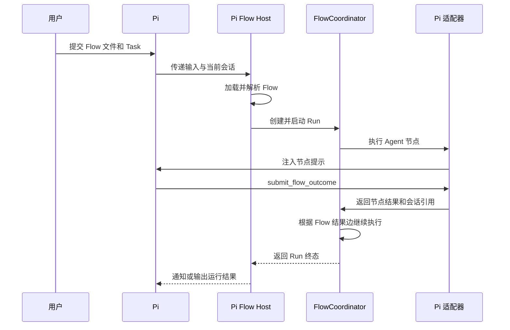

# Pi Flow 启动入口设计

## 1. 定位

Pi Flow 启动入口是 Agent Flow Runtime 在 Pi 中的宿主适配。它负责接收用户提交的 Task，加载指定的 Flow，并让 Runtime 使用当前 Pi 会话执行 Agent 节点。

Pi 提供会话、模型、工具和交互界面。Flow 的解析、节点结果和路径流转仍由通用 Runtime 负责。

```text
用户 Task + Flow 文件
          |
          v
Pi Flow Host
          |
          v
Agent Flow Runtime
          |
          v
Pi Agent 会话
```

## 2. 用户入口

扩展提供两种启动方式：

```text
pi --flow <文件> <任务>
/flow run <文件> <任务>
```

也支持 Pi 的打印、JSON 和 RPC 模式。不同入口只改变 Task 如何进入 Runtime，不改变 Flow 的执行方式。

启动时，Pi Flow Host 完成以下工作：

1. 通过`loadFlow`读取单文件或目录包，得到定义、规范化入口和资源上下文。
2. 创建 Pi 适配器、运行记录存储和`FlowCoordinator`。
3. 将 Task 和 FlowDefinition 交给协调器。
4. 等待 Run 完成，并将终态通知 Pi 用户或输出通道。

## 3. 模块职责

### Pi Flow Host

Pi Flow Host 是 `src/extension.ts` 中的宿主层，负责：

- 注册`--flow`和`/flow run`。
- 把 Pi 当前会话交给 Pi Agent 适配器。
- 启动并等待一次 Flow Run。
- 在 CLI 会话切换时重新绑定扩展上下文。
- 在运行结束或失败时清理宿主状态。

它不解析节点结果，不选择下一节点，也不直接修改运行记录。

### Pi Agent 适配器

Pi 适配器负责：

- 创建、接管和释放 Pi 会话。
- 把当前节点提示注入 Pi。
- 注册并处理`submit_flow_outcome`。
- 保存节点对应的 Pi 会话和交互范围。

它不读取 Mermaid 图，也不决定 Flow 去向。具体实现见[Pi Agent 集成适配器实现设计](pi-agent-integration-adapter-design.md)。

### Agent Flow Runtime

Runtime 负责一次 Run 的全部流程语义：

- 创建和更新 Run。
- 执行节点。
- 校验 Agent 提交的结果。
- 根据结果边推进或结束流程。
- 保存 NodeRun 和并行轮次。

## 4. 当前会话和 Agent 动作

Pi CLI 启动时通常已经有一个当前会话。Pi Flow Host 将它作为 Runtime 可使用的 Agent 会话来源。

- 首个 Agent 节点是`新建Agent`时，适配器把当前会话建立为本次 Run 的新绑定；后续新建动作可以触发新的 Pi 会话。
- 首个 Agent 节点是`复用Agent`时，适配器接管当前会话作为已有绑定。
- 后续`复用Agent`继续使用本次 Run 当前绑定的会话。

这里的“新建”和“复用”是 Flow 路径中的 Agent 会话动作，不是 Pi Flow Host 的流程控制动作。

CLI 中，新建会话通过扩展注册的`flow-new-session`命令调用`ctx.newSession()`完成。扩展重载时，进程级状态负责把正在等待的 Run 和下一节点交接给新会话。

## 5. 一次启动流程



原始用户输入被 Host 接管后，不再作为普通 Pi 对话提示重复执行。后续节点由 Runtime 根据结果边生成，并由适配器注入当前会话。

## 6. 无头模式

无头模式仍使用 Pi 的现有输出协议：

| 模式 | 用途 |
| --- | --- |
| `-p` | 执行一次 Run，等待完整流程结束 |
| `--mode json` | 输出 JSONL，供脚本读取结构化事件 |
| `--mode rpc` | 由外部进程提交 Task，并读取会话事件 |

无头调用方应以 Run 的终态和结构化结果作为执行结果，不应通过 Agent 的自然语言输出判断 Flow 是否结束。

## 7. 状态展示

Pi Host 可以展示当前 Run 的简要状态，例如当前 Flow、当前节点、等待中的并行轮次和最终错误。展示内容来自 Runtime 的运行记录，不单独维护一份流程状态。

Pi 宿主通过统一 Runtime 入口提供 `/flow list`、`/flow show <runId>`、JSON/RPC `flow_event` 消息和 Agent 的只读 `inspect_flow_run` 工具。重连时先读取 Inspector 快照，再订阅后续事件；持续事件为尽力而为通知，不补发断线期间的全部事件。

## 8. 必须保持的规则

- Pi 是 Agent 宿主，不改变通用 Flow 文件格式。
- Pi Flow Host 负责启动和承载，FlowCoordinator 负责路径和状态。
- Agent 只能通过`submit_flow_outcome`提交节点结果。
- Host 和适配器不能直接选择下一节点。
- 一个 Pi 会话同一时间只执行一个 Flow 节点。
- 节点会话引用归属于对应 NodeRun，循环访问同一节点时必须产生新的 NodeRun。
- 无头模式等待整个 Run 结束，并使用结构化结果读取终态。

## 9. 实现依据

当前实现位于[Pi Flow 扩展入口](../src/extension.ts)，安装和运行命令见[实现 README](../README.md)。Pi 适配器的会话、结果提交和交互关联见[Pi Agent 集成适配器实现设计](pi-agent-integration-adapter-design.md)。