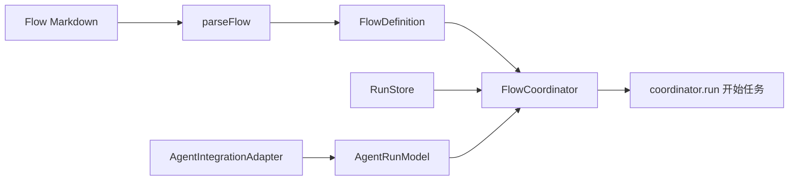

# SDK 快速开始

面向在自己的 Node.js 程序中嵌入 Agent Flow Runtime 的开发者。安装后即可解析 Flow 文件、驱动节点流转，并把 Agent 节点交给 Pi 会话执行。Flow 文件格式见[Flow 规范](flow-spec.md)，本文不重复。

## 1. 安装

```bash
npm install @jhihjian/agent-flow-runtime
```

要求 Node.js 不低于 22.19。运行时有两个 peer 依赖：

- `@earendil-works/pi-coding-agent`：Pi SDK，Agent 节点的执行载体。
- `typebox`：结果提交工具的参数 Schema。

npm 7 及以上会自动安装 peer 依赖。使用 pnpm 时需开启 `auto-install-peers=true` 或显式安装这两个包。

## 2. 四个组装件

SDK 的核心是一次组装：

| 组装件 | 职责 | 常用实现 |
| --- | --- | --- |
| `loadFlow(path)` | 加载包目录或`FLOW.md`，返回定义、入口路径和包资源上下文 | CLI 和 SDK 的文件入口 |
| `parseFlow(markdown, id)` | 把内存中的 Flow Markdown 解析为 `FlowDefinition` | 纯函数，调用方显式提供标识 |
| `RunStore` | 保存 Flow 运行和节点访问记录 | `InMemoryRunStore`、`JsonFileRunStore` |
| `AgentRunModel` | 按运行维护 Agent 绑定，执行 Agent 节点 | 构造时传入一个 `AgentIntegrationAdapter` |
| `FlowCoordinator` | 解释结果边，推动节点流转 | 构造时组合前三者 |



命令节点由 `FlowCoordinator` 的第四个可选参数 `CommandExecutor` 执行，默认 `ProcessCommandExecutor` 会真实 spawn 进程，一般无需替换。

## 3. 最小可运行示例

以下示例不需要模型和 API Key，用一个假适配器代替 Pi 会话，验证组装和理解结果流转。示例使用 TypeScript 和顶层 await，先在项目里准备两个条件：

```bash
npm pkg set type=module           # 顶层 await 需要 ESM，npm init 默认 commonjs
npm install --save-dev tsx        # TypeScript 执行器，不是本包的依赖
```

然后把以下内容保存为 `demo.ts`，运行 `node --import tsx demo.ts`。

```typescript
import {
	AgentRunModel,
	FlowCoordinator,
	InMemoryRunStore,
	parseFlow,
	type AgentIntegrationAdapter,
} from "@jhihjian/agent-flow-runtime";

const markdown = `---
name: 演示流程
description: SDK 快速开始的最小示例。
---

\`\`\`mermaid
flowchart TD
  start((开始)) --> analyze[分析任务]
  analyze -->|已分析| finishNode[完成任务]
  finishNode -->|已完成| finish((结束))
\`\`\`

## 分析任务

\`\`\`新建Agent
分析任务：
{outcome}
\`\`\`

### 已分析

已得到下一步所需结论。

## 完成任务

\`\`\`复用Agent
根据分析结果完成任务：
{outcome}
\`\`\`

### 已完成

任务已结束。
`;

const flow = parseFlow(markdown, "demo");

const fakeAdapter: AgentIntegrationAdapter = {
	async createAgent({ runId }) {
		return { id: `${runId}:agent`, platformReference: `${runId}:agent` };
	},
	async takeOverAgent({ agentReference }) {
		return { id: agentReference, platformReference: agentReference };
	},
	async executeNode(request) {
		await request.submitOutcome({
			nodeExecutionReference: request.nodeExecutionReference,
			result: request.outcomes[0].name,
			content: "演示结果内容",
		});
		return { id: request.nodeExecutionReference };
	},
	async getNodeSession() {
		return [];
	},
	async releaseAgent() {},
};

const store = new InMemoryRunStore();
const coordinator = new FlowCoordinator(
	flow,
	store,
	new AgentRunModel(fakeAdapter),
);

const run = await coordinator.run("验证登录超时问题");
console.log(run.status); // completed
```

假适配器总是提交当前节点的第一个结果，适合线性 Flow 的演示和测试。真实场景换成下一节的 `PiAgentIntegrationAdapter` 即可，其余代码不变。

## 4. 用 Pi 会话执行 Agent 节点

`PiAgentIntegrationAdapter` 通过 Pi SDK 创建真实会话，并在会话中自动注入 `submit_flow_outcome` 工具，Agent 节点的提示词渲染和结果校验由运行时完成。

```typescript
import { readFile } from "node:fs/promises";
import {
	AgentRunModel,
	FlowCoordinator,
	JsonFileRunStore,
	parseFlow,
	PiAgentIntegrationAdapter,
} from "@jhihjian/agent-flow-runtime";

const flow = parseFlow(
	await readFile("./.flows/code-change/FLOW.md", "utf8"),
	"code-change",
);

const adapter = new PiAgentIntegrationAdapter({ cwd: process.cwd() });
const coordinator = new FlowCoordinator(
	flow,
	new JsonFileRunStore(".pi/flow-runs.json"),
	new AgentRunModel(adapter),
);

const run = await coordinator.run("修复登录超时问题");
console.log(run.status); // completed
```

前提条件：

- 已安装 peer 依赖 `@earendil-works/pi-coding-agent`。
- Pi 的模型认证已配置，遵循 Pi 约定：`~/.pi/agent/auth.json`、环境变量（如 `ANTHROPIC_API_KEY`）或 settings 中的默认模型。
- Flow 中存在 Agent 节点时会真实调用 LLM，产生模型调用费用。

## 5. 会话与记录保存在哪里

SDK 宿主自己决定持久化位置，运行时不做隐藏写入：

| 数据 | 保存位置 |
| --- | --- |
| Pi 会话日志 | 默认 `~/.pi/agent/sessions/--<工作目录编码>--/<会话id>.jsonl`；传入 `sessionDir` 选项时保存到该目录 |
| Flow 运行记录 | 传给 `RunStore` 的位置；`JsonFileRunStore` 写入指定 JSON 文件 |
| 内存模式 | `InMemoryRunStore` 不落盘，适合测试 |

Pi 会话日志与 Pi CLI 交互模式的会话同目录同格式：工作目录路径中的 `/` 和 `:` 被替换为 `-` 并以 `--` 包裹。例如 `cwd` 为 `/data/dev/SUMM` 时，会话目录是 `~/.pi/agent/sessions/--data-dev-SUMM--`。因此 SDK 创建的会话可以被 `pi -r` 找回并继续。会话 jsonl 文件在首次消息写入后才落盘，仅创建会话不执行节点不会产生文件。

## 6. 恢复与接管

两种典型场景：

```typescript
// 场景一：从已有 Pi 会话文件开始，接管为本次运行的 Agent
const run = await coordinator.run("继续上次的任务", {
	existingAgentReference: "/home/me/.pi/agent/sessions/--data-dev-SUMM--/abc.jsonl",
});

// 场景二：恢复一次中断的 Flow 运行（要求使用 JsonFileRunStore 持久化）
const resumed = await coordinator.resume(runId, {
	existingAgentReference: "/home/me/.pi/agent/sessions/--data-dev-SUMM--/abc.jsonl",
});
```

`resume` 会读取持久化记录，从当前节点继续，中断的 Agent 节点按重试访问重新提交；中断的自定义命令节点因外部副作用不可重放，直接标记失败。Pi CLI 扩展的中断恢复行为见[实现 README](../README.md)。

## 7. API 概览

完整类型定义见发布包的 `dist/index.d.ts`。

| 分类 | 导出 | 用途 |
| --- | --- | --- |
| 解析 | `parseFlow(markdown, id)` | 解析内存 Flow Markdown，抛出 `FlowSyntaxError` |
| 解析 | `loadFlow(path)` | 加载 Flow 包目录或`FLOW.md`入口 |
| 解析 | `FlowDirectory` | 递归发现和加载 Flow 包 |
| 运行时 | `FlowCoordinator` | 解释结果边，`run` 启动，`resume` 恢复 |
| 运行时 | `AgentRunModel` | 维护 Agent 绑定，执行 Agent 节点 |
| 运行时 | `InMemoryRunStore` / `JsonFileRunStore` | 运行记录的内存与 JSON 文件存储 |
| 运行时 | `ProcessCommandExecutor` | 默认命令执行器，真实 spawn 进程 |
| Pi 集成 | `PiAgentIntegrationAdapter` | 用 Pi SDK 会话实现 Agent 适配器 |
| Pi 集成 | `PiAgentAdapterOptions` | `cwd`、`sessionDir`、`cliBridge` 选项 |
| Pi 集成 | `createFlowOutcomeTool` | 供 CLI bridge 宿主注册结果提交工具，SDK 宿主不需要 |
| 类型 | `FlowDefinition`、`FlowNode`、`FlowRunRecord`、`NodeRunRecord` | Flow 与运行记录的结构类型 |
| 类型 | `AgentIntegrationAdapter`、`AgentConnection`、`NodeSession` | 自定义 Agent 平台接入的边界接口 |
| 类型 | `RunStore`、`CommandExecutor`、`CommandRequest`、`CommandResult` | 自定义存储与命令执行的边界接口 |

自定义 Agent 平台只需实现 `AgentIntegrationAdapter` 接口：创建、接管、执行节点（内含 `submitOutcome` 回调）、读取交互、释放。Pi 之外的宿主可以完全复用运行时。

## 8. 继续阅读

- 编写 Flow 文件：[Flow 规范](flow-spec.md)
- 理解运行模型：[Flow 概览](flow-overview.md)
- Pi 适配器实现细节：[Pi Agent 集成适配器实现设计](pi-agent-integration-adapter-design.md)
