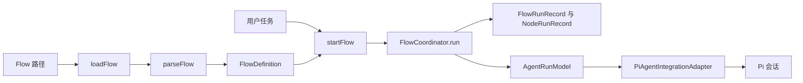
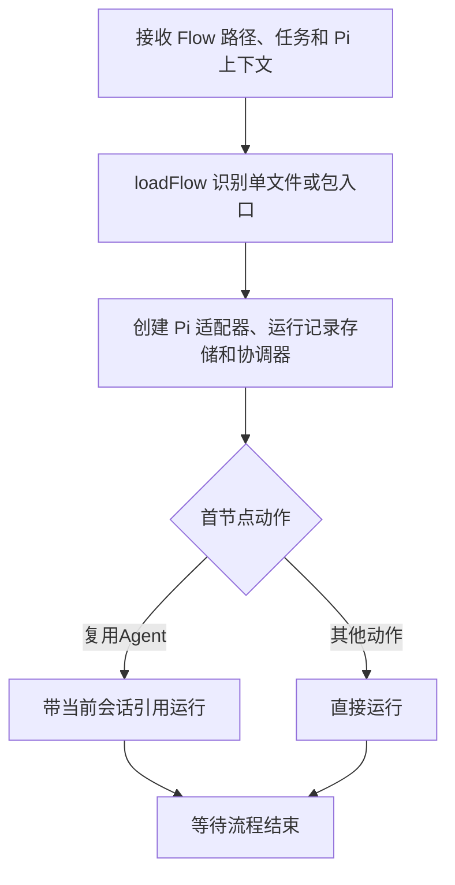
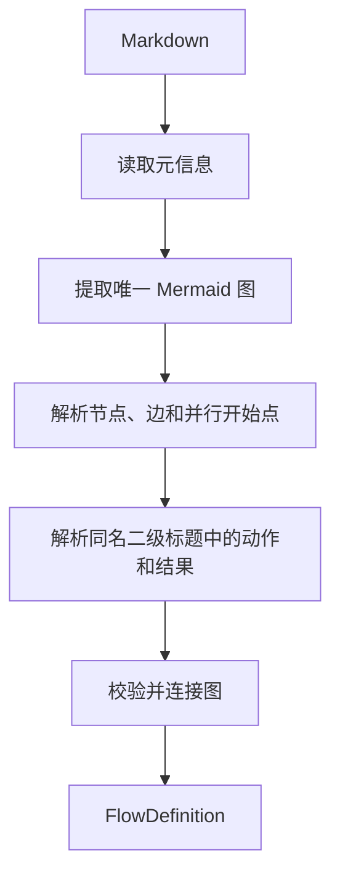
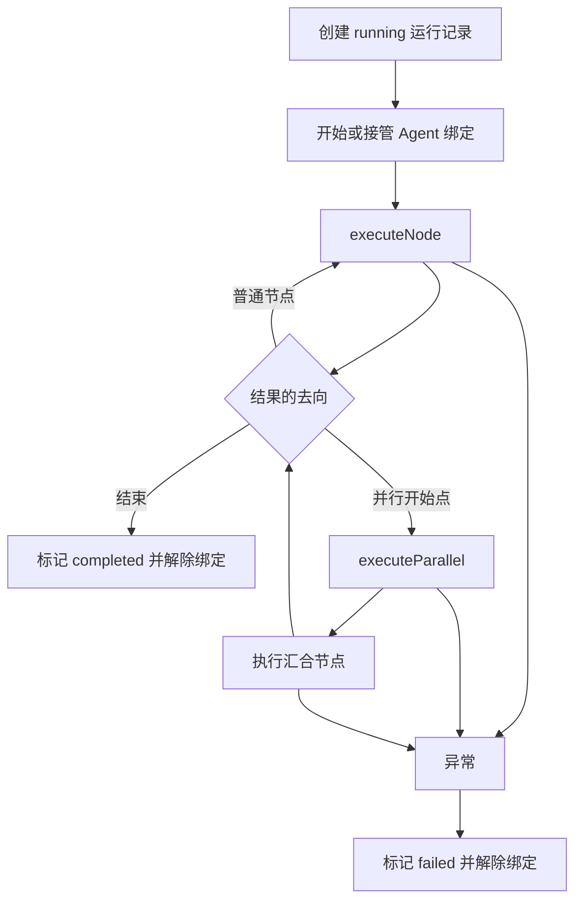
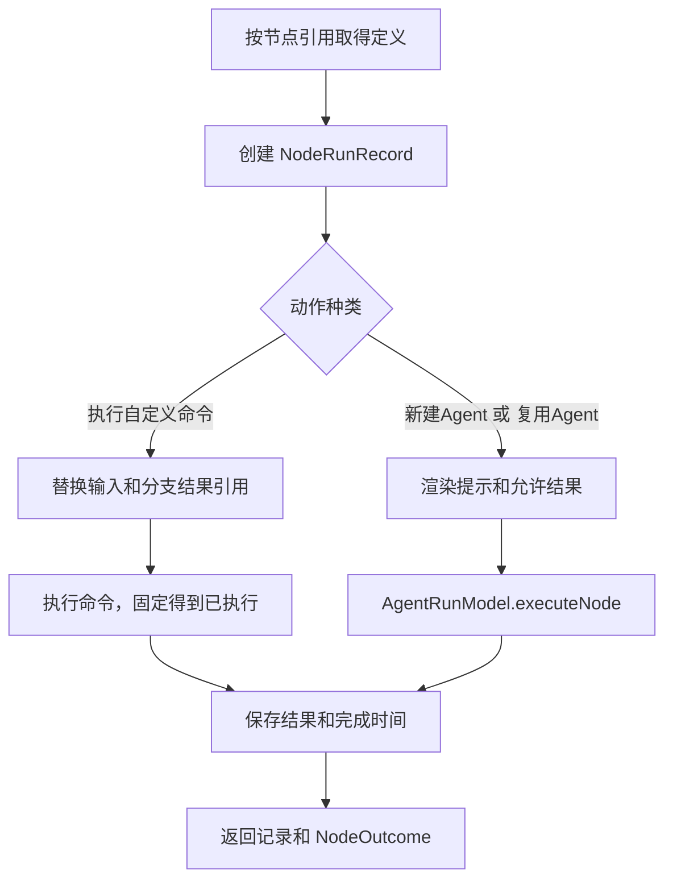
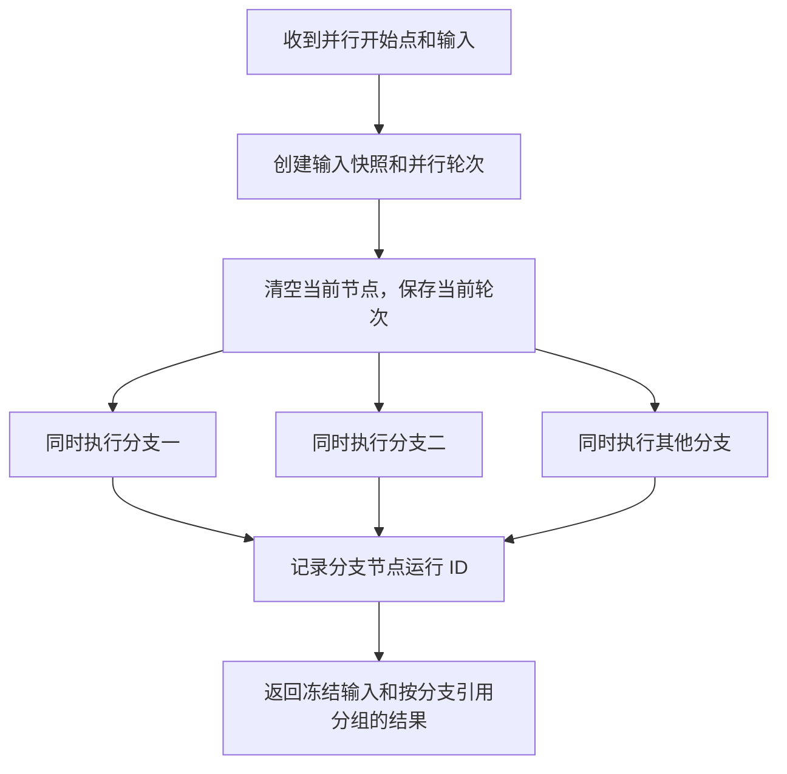
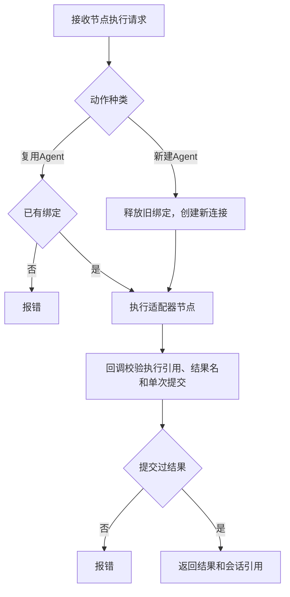
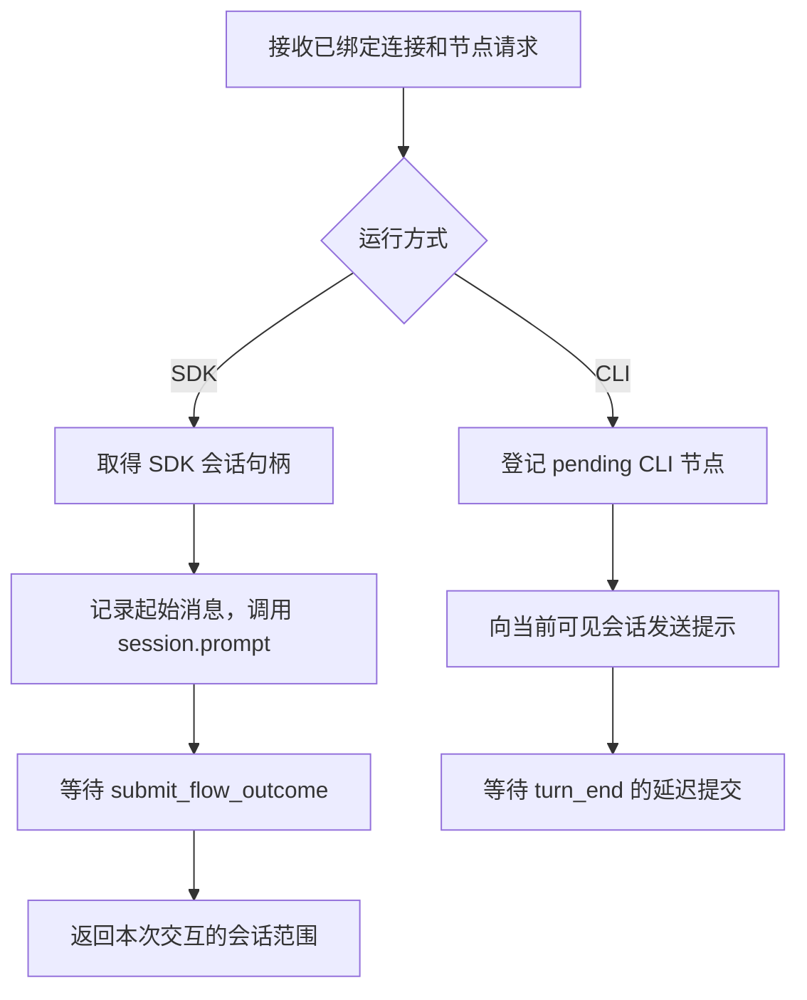
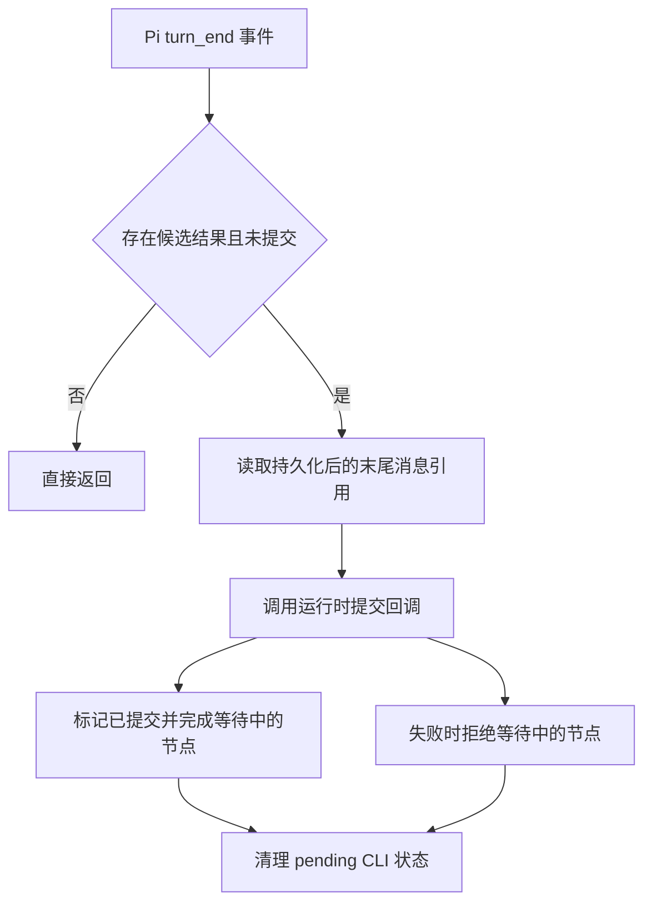

# 源码逻辑阅读图

本文按关键函数展示 Agent Flow Runtime 的控制流。每一节把 Mermaid 图、压缩伪代码和确切源码位置放在一起，便于从运行场景跳回实现。

图和伪代码是阅读辅助，不是另一份规范。静态 Flow 格式以[Flow 规范](flow-spec.md)为准，完整的模块和符号位置见自动生成的[源码符号索引](source-index.md)。

## 使用方式

- 先从与问题最接近的场景进入，不必顺序阅读所有文件。
- 图只表达当前函数的关键分支和数据去向，省略局部错误文本、日志与类型细节。
- 每个“源码”链接由`npm run docs:source-index`生成。修改关键函数后必须运行该命令，`npm run check`会检查位置和阅读区块是否过期。

## 全局数据流



四个贯穿整个运行时的值：

| 值 | 负责者 | 含义 |
| --- | --- | --- |
| `FlowDefinition` | `parser.ts` | 已校验的静态节点、结果边和并行定义。 |
| `FlowRunRecord` | `FlowCoordinator` | 一次运行的状态、当前节点或当前并行轮次。 |
| `NodeRunRecord` | `FlowCoordinator` | 每次进入节点的输入、结果、时间和会话引用。 |
| `NodeOutcome` | 节点执行方 | `result`选择下一条边，`content`成为后续输入。 |

## 函数级逻辑图

### 1. 启动 Flow

<!-- source-guide:start-flow -->
<!-- source-guide:location:start-flow -->
**源码：** [src/extension.ts:306-385](../src/extension.ts#L306)，`启动 Flow`
<!-- /source-guide:location:start-flow -->



```text
startFlow(路径, 任务, Pi上下文):
    拒绝已有正在运行的 Flow
    loaded = loadFlow(路径)
    flow = loaded.flow
    创建 PiAgentIntegrationAdapter、JsonFileRunStore、FlowCoordinator
    如果首节点是复用Agent:
        coordinator.run(任务, 当前 Pi 会话引用)
    否则:
        coordinator.run(任务)
    无论成功或失败都清理扩展中的活动状态
```
<!-- /source-guide:start-flow -->

入口把 Pi CLI/TUI 的上下文转换为运行时依赖，不解释 Mermaid 图，也不选择节点去向。

### 2. 解析 Flow

<!-- source-guide:parse-flow -->
<!-- source-guide:location:parse-flow -->
**源码：** [src/parser.ts:44-82](../src/parser.ts#L44)，`解析 Flow`
<!-- /source-guide:location:parse-flow -->



```text
parseFlow(Markdown, 文件名, 可选标识):
    id = 采用可选标识，缺省时从文件名取得
    metadata = 校验唯一且非空的 name、description
    graph = 解析唯一的 flowchart TD
    sections = 解析每个节点标题下的动作和结果说明
    为每个图节点合并对应 section
    校验可达性、结果边、命令节点、并行和汇合约束
    返回 FlowDefinition
```
<!-- /source-guide:parse-flow -->

这个函数只构造可信的静态定义。它不执行命令、不创建 Agent，也不保存某次运行状态。

### 3. 驱动一次运行

<!-- source-guide:coordinator-run -->
<!-- source-guide:location:coordinator-run -->
**源码：** [src/runtime.ts:552-591](../src/runtime.ts#L552)，`驱动一次运行`
<!-- /source-guide:location:coordinator-run -->



```text
run(任务, 可选已有会话):
    创建并保存 running 的 FlowRunRecord
    让 AgentRunModel 建立或接管绑定
    从首节点开始循环:
        结果 = executeNode(当前节点, 当前输入)
        去向 = 查询(当前节点, 结果.result)
        结束时完成运行并返回
        普通节点时保存下一节点和结果内容，继续循环
        并行时执行分支，再执行汇合节点并继续路由
    任意异常时记录失败，解除绑定后重新抛出
```
<!-- /source-guide:coordinator-run -->

协调器是唯一改变 `FlowRunRecord`、`NodeRunRecord` 和节点输入的模块。

### 4. 执行单个节点

<!-- source-guide:execute-node -->
<!-- source-guide:location:execute-node -->
**源码：** [src/runtime.ts:906-928](../src/runtime.ts#L906)，`执行单个节点`
<!-- /source-guide:location:execute-node -->



```text
executeNode(run, 节点引用, 输入, 分支结果):
    node = 从 FlowDefinition 取得节点
    record = 创建并保存本次 NodeRunRecord
    如果是命令节点:
        request = 替换 {outcome} 与 {分支.outcome}
        outcome = 已执行 + 命令执行结果
    否则:
        prompt = 注入输入和允许结果
        outcome, session = AgentRunModel.executeNode(...)
        record.session = session
    保存 outcome 和 completedAt
    返回 record、outcome
```
<!-- /source-guide:execute-node -->

循环重试与并行分支也调用这个函数，因此每次进入节点都留下独立记录。

### 5. 执行并行分支

<!-- source-guide:execute-parallel -->
<!-- source-guide:location:execute-parallel -->
**源码：** [src/runtime.ts:817-904](../src/runtime.ts#L817)，`执行并行分支`
<!-- /source-guide:location:execute-parallel -->



```text
executeParallel(run, 并行引用, 输入):
    parallel = 取得已校验的并行定义
    round = 保存 input 快照与分支记录表
    将 run 切换为 currentParallelRound
    并发执行每个分支，并回填本轮分支记录 ID
    返回 input 快照和每个分支的 NodeOutcome
```
<!-- /source-guide:execute-parallel -->

分支只允许命令节点。汇合节点使用的是该轮冻结的输入和该轮分支结果，不会读取历史轮次。

### 6. 管理 Agent 节点

<!-- source-guide:agent-execute-node -->
<!-- source-guide:location:agent-execute-node -->
**源码：** [src/runtime.ts:447-504](../src/runtime.ts#L447)，`管理 Agent 节点`
<!-- /source-guide:location:agent-execute-node -->



```text
AgentRunModel.executeNode(请求):
    新建Agent时替换运行级绑定
    复用Agent时要求已有绑定
    调用 adapter.executeNode，并提供一次性提交回调
    回调校验节点执行引用和允许结果名
    未提交结果即结束视为失败
    返回已接受的结果与节点会话引用
```
<!-- /source-guide:agent-execute-node -->

这一层定义跨 Agent 平台都适用的契约，不读取 Flow 图，也不决定下一条边。

### 7. 执行 Pi 节点

<!-- source-guide:pi-execute-node -->
<!-- source-guide:location:pi-execute-node -->
**源码：** [src/pi.ts:107-140](../src/pi.ts#L107)，`执行 Pi 节点`
<!-- /source-guide:location:pi-execute-node -->



```text
PiAgentIntegrationAdapter.executeNode(请求):
    CLI 模式委托 executeCliNode，等待 turn_end 完成
    SDK 模式要求连接存在且没有并发 pending 节点
    保存起始消息引用和待提交状态
    session.prompt(提示)
    要求结果工具已提交，否则失败
    返回会话引用和本次交互的起止引用
```
<!-- /source-guide:pi-execute-node -->

SDK 模式在一次 `prompt` 返回后提交结果。CLI 模式必须等待 Pi 将消息持久化，下一节解释该差异。

### 8. 提交 CLI 节点结果

<!-- source-guide:finalize-cli-turn -->
<!-- source-guide:location:finalize-cli-turn -->
**源码：** [src/pi.ts:181-209](../src/pi.ts#L181)，`提交 CLI 节点结果`
<!-- /source-guide:location:finalize-cli-turn -->



```text
finalizeCliTurn():
    没有候选结果或已提交时直接返回
    读取当前叶消息作为本次交互终点
    将候选 result、content 与消息范围提交给运行时
    成功时完成 executeCliNode 的等待 Promise
    失败时拒绝该 Promise
    最终清理 pendingCli
```
<!-- /source-guide:finalize-cli-turn -->

CLI 路径把工具调用先保存为候选结果，直到 `turn_end` 才正式提交，从而确保 `NodeRunRecord` 指向完整且已持久化的会话交互。

## 建议阅读顺序

| 目标 | 首先阅读 | 然后阅读 |
| --- | --- | --- |
| 理解 Flow 文件为何会被拒绝 | 解析 Flow | `parser.ts`中的各项校验和 `test/parser.test.ts`。 |
| 排查节点没有走到预期分支 | 驱动一次运行 | 执行单个节点，再查看运行记录中的 `result` 与 `content`。 |
| 排查并行汇合输入错误 | 执行并行分支 | 执行单个节点与 Flow 规范中的并行约束。 |
| 排查 Agent 提交失败或结果丢失 | 管理 Agent 节点 | 执行 Pi 节点、提交 CLI 节点结果与 `test/adapter-contract.test.ts`。 |
| 排查 Pi CLI 中的新会话或后续提示 | 启动 Flow | 执行 Pi 节点和 `extension.ts`中的事件绑定。 |