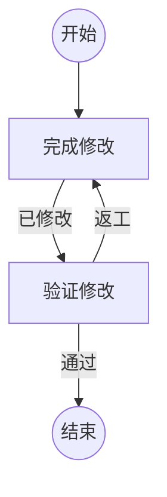

```mermaid
flowchart TD
  start((开始)) --> change[完成修改]
  change -->|已修改| verify[验证修改]
  verify -->|通过| finish((结束))
  verify -->|返工| change
```

## 完成修改

```新建Agent
完成以下代码修改：
{outcome}
```

### 已修改

修改已完成，并附上后续验证所需信息。

## 验证修改

```复用Agent
验证以下修改结果：
{outcome}
```

### 通过

验证已通过。

### 返工

验证发现需要回到修改节点的问题。