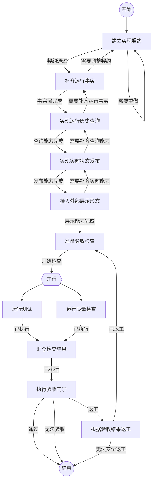

## 建立实现契约

```新建Agent
围绕以下任务建立本次开发的实现契约：
{outcome}

请先阅读：
- docs/flow-observability-design.md
- docs/agent-flow-runtime-architecture.md
- src/types.ts
- src/runtime.ts
- src/extension.ts

明确以下内容：
- 一次 Run 的完整历史应包含哪些信息。
- FlowRunInspector 的查询边界和返回模型。
- FlowObservationPublisher 的事件边界和失败语义。
- RunStore 快照、实时事件和外部展示之间的职责边界。
- TUI、CLI、SDK、JSON、RPC 和 Agent 如何复用同一个 Runtime 入口。
- 如何验收普通路径、返工、并行、失败、恢复和断线场景。

本节点先完成契约审查，不进行大范围编码。契约必须保持 Flow 是可复用工作路径，Task 是本次具体任务。完成后必须调用 submit_flow_outcome。
```

### 契约通过

实现范围、接口边界、状态语义和验收条件已经明确，可以进入运行事实层。

### 需要重做

当前契约仍混淆了 Flow、Task、Run 或 NodeRun，或者无法说明历史、实时状态和验收的边界。请修正契约后再次提交。

## 补齐运行事实

```复用Agent
根据已确认的实现契约，补齐 Runtime 能够解释一次完整 Run 的运行事实：
{outcome}

重点完成：
- Run 和 NodeRun 的显式状态、阶段、错误和恢复语义。
- 每次节点访问的执行顺序、进入来源和结果。
- 并行轮次、分支和汇合关系的持久化。
- Flow 版本或内容指纹，保证恢复和历史解释有明确依据。
- Agent 节点异常、命令中断和进程恢复的记录闭环。
- JsonFileRunStore 的旧数据读取、快照完整性和安全写入。

不要在本节点实现 TUI、CLI、RPC 或外部监控平台。完成后运行与运行事实相关的测试，并在结果中说明修改范围和验证证据。完成后必须调用 submit_flow_outcome。
```

### 事实层完成

Run、NodeRun 和并行轮次已经足够完整，能够在不依赖日志猜测的情况下解释执行历史。

### 需要调整契约

实现过程中发现原契约无法覆盖真实运行语义。请说明冲突原因和需要重新确认的边界，回到契约节点。

## 实现运行历史查询

```复用Agent
根据实现契约和已完成的运行事实层，实现 Runtime 内部的统一运行历史查询能力：
{outcome}

实现目标：
- 提供 FlowRunInspector.inspectRun(runId)。
- 返回 Run 摘要、当前状态、完整 NodeRun 路径、路由原因、返工、并行轮次和执行依据引用。
- 提供按 NodeRun 查询执行依据的能力，完整 Pi 会话和命令输出按需读取。
- 不让调用方直接拼接 getRun、listNodeRuns 或读取 JSON 文件。
- 不让 Inspector 修改 Run、选择路径或提交节点结果。
- 普通路径、循环、并行、失败和恢复使用同一份历史视图。

为查询模型编写测试，并从包的公共入口导出需要公开的类型和方法。完成后必须调用 submit_flow_outcome。
```

### 查询能力完成

调用方只需提供 runId，就能获得一份可以直接分析的完整 Run 历史视图。

### 需要补齐运行事实

Inspector 无法可靠还原节点顺序、进入原因或并行历史。请回到运行事实层补齐持久化依据。

## 实现实时状态发布

```复用Agent
根据统一历史查询模型，实现运行过程的实时状态发布：
{outcome}

实现目标：
- 定义 FlowObservationEvent 和 FlowObservationPublisher。
- 在 FlowCoordinator 状态持久化成功后发布运行事实事件。
- 覆盖 Run 开始、节点开始、节点完成或失败、路由选择、并行开始或完成、恢复和 Run 终态。
- 为同一 Run 提供单调的事件顺序标识。
- Publisher 失败不能改变 Run 状态，也不能阻断 Flow 执行。
- 事件只携带状态、引用和摘要，不默认携带完整任务、Prompt、对话或命令输出。

测试事件顺序、并行分支、状态保存失败、Publisher 失败和订阅清理。完成后必须调用 submit_flow_outcome。
```

### 发布能力完成

协调器能够在状态保存后发布统一运行事实，且发布失败不会污染流程执行。

### 需要补齐查询能力

实时事件缺少可恢复的历史快照或无法与 NodeRun 关联。请回到运行历史查询节点补齐统一模型。

## 接入外部展示形态

```复用Agent
根据 FlowRunInspector 和 FlowObservationPublisher，接入运行观测的外部形态：
{outcome}

所有形态必须是薄适配器，共用同一份历史视图和事件模型：
- SDK：提供 inspectRun 和订阅运行事件的方法。
- CLI：提供 /flow show <runId>，展示完整执行路径。
- TUI：启动和重连时读取快照，运行中订阅事件，展示当前节点和并行分支。
- JSON/RPC：输出 flow_event，不依赖自然语言或 submit_flow_outcome 推断流程状态。
- Agent：通过宿主提供的查询接口调用 FlowRunInspector，不直接访问存储。

断线后先读取快照再接收后续事件。不要在本节点接入 Prometheus、OpenTelemetry 或外部告警平台。完成后必须调用 submit_flow_outcome。
```

### 展示能力完成

外部形态都能通过统一 Runtime 入口查看同一份 Run 历史，并能实时看到状态变化。

### 需要补齐实时能力

某个展示形态仍在自行推断状态，或无法接收节点、并行和终态事件。请回到实时状态发布节点补齐事件契约。

## 准备验收检查

```复用Agent
准备对本次观测能力实现执行验收检查：
{outcome}

确认本轮检查范围包括运行事实、历史查询、实时发布、外部展示和恢复行为。不要在本节点修改代码。确认范围后进入并行测试和质量检查。完成后必须调用 submit_flow_outcome。
```

### 开始检查

验收范围已经确认，可以并行运行测试和质量检查。

## 运行测试

```执行自定义命令
{
  "command": "npm",
  "args": ["test"]
}
```

### 已执行

已运行完整测试，结果保存在本节点结果内容中。

## 运行质量检查

```执行自定义命令
{
  "command": "npm",
  "args": ["run", "check"]
}
```

### 已执行

已运行格式、类型和文档索引检查，结果保存在本节点结果内容中。

## 汇总检查结果

```执行自定义命令
{
  "command": "node",
  "args": [
    "-e",
    "let s='';process.stdin.on('data',c=>s+=c).on('end',()=>console.log(s))"
  ],
  "stdin": {
    "test": {test.outcome},
    "quality": {quality.outcome}
  }
}
```

### 已执行

已汇总测试和质量检查结果，下一节点负责验收。

## 执行验收门禁

```复用Agent
根据以下实现结果和检查汇总执行最终验收：
{outcome}

必须逐项检查：
- Flow 仍然只是可复用工作路径，Task、Run、NodeRun 概念没有混淆。
- 一次 Run 的普通路径、返工、并行和恢复历史可以完整解释。
- FlowRunInspector 是 Runtime 内部统一查询入口，外部形态没有重复拼装历史。
- FlowObservationPublisher 只发布事实，不改变流程状态。
- TUI、CLI、SDK、JSON、RPC 和 Agent 使用同一份查询和事件模型。
- 断线、进程重启、节点失败、命令中断和观测推送失败有明确行为。
- 测试、类型检查、格式检查和文档检查均有证据。

只有所有门禁都满足时才能提交“通过”。发现可以修复的问题提交“返工”，并在 content 中明确返工位置和原因。若当前环境或需求无法支持可靠验收，提交“无法验收”并说明缺失条件。完成后必须调用 submit_flow_outcome。
```

### 通过

观测能力已按契约实现，运行历史可查询，过程状态可实时展示，验收测试和质量检查均通过。

### 返工

验收发现可修复的问题。结果内容必须列出问题、对应模块和下一轮验证方式，流程将进入返工节点。

### 无法验收

当前环境、依赖或外部条件不足以完成可靠验收。结果内容必须列出已检查范围、缺失条件和不能得出的结论。

## 根据验收结果返工

```复用Agent
根据上一次验收结果进行一次有边界的返工：
{outcome}

只修复验收指出的问题。先确认问题属于运行事实、历史查询、实时发布还是展示适配，再修改对应模块。不要通过降低测试标准、隐藏错误或增加与 Flow 无关的监控组件来绕过门禁。完成后说明修改内容、原因和可能影响，并调用 submit_flow_outcome。
```

### 已返工

已完成一轮针对验收问题的修复，流程将重新运行并行检查和验收门禁。

### 无法安全返工

当前问题无法在已有契约和证据范围内安全修复。结果内容必须说明阻塞原因、已尝试范围和需要外部决策的事项。