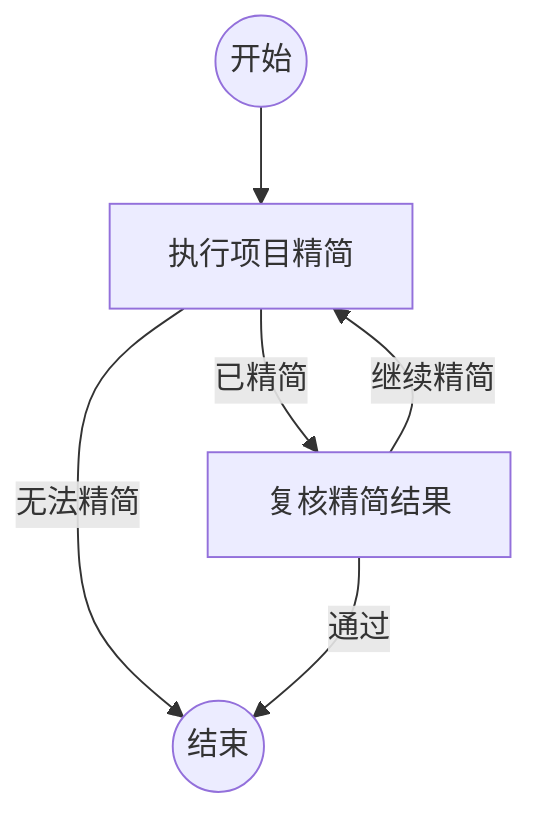

## 执行项目精简

```新建Agent
审视该项目是否存在过度设计、过度校验的问题，能不能考虑不是修补打补丁的方案，而是考虑问题的共性和降低项目维护成本，不要做任何历史兼容工作，任何兼容性的工作都是可以删除的，做一次精简。如果已经无法精简了，可以汇报原因。

请按以下原则完成本节点：

- 先理解项目中待处理问题的共性、重复模式和长期维护成本，再决定修改方案。
- 优先采用能够减少抽象、分支、重复校验和特殊路径的整体方案，不要只做局部补丁。
- 不要保留任何仅为历史版本、旧调用方或旧数据格式服务的兼容逻辑；兼容性工作可以删除。
- 实际完成可以验证的精简，并说明删除或合并了什么，以及为什么不会改变当前需求语义。
- 如果已经没有合理的精简空间，提交“无法精简”，在 content 中汇报检查范围、保留项和无法继续精简的具体原因。

当前输入：
{outcome}
```

### 已精简

已完成一次有依据的整体精简，并提供了修改范围、共性问题和验证证据，交给门禁节点复核。

### 无法精简

已审视当前项目，没有找到能够在不改变当前需求语义的前提下继续降低复杂度的方案，并在结果中说明了检查范围和原因。

## 复核精简结果

```复用Agent
对上一轮项目精简结果执行门禁复核：

{outcome}

请重新审视该项目是否仍存在过度设计、过度校验、重复抽象、特殊分支或仅用于历史兼容的逻辑。不要接受只修补表面症状的方案，优先判断是否能够提炼问题共性并降低长期维护成本。不要做任何历史兼容工作，任何兼容性的工作都是可以删除的。

如果仍能通过删除、合并或简化降低项目复杂度，请直接完成下一轮精简，并提交“继续精简”，说明修改内容和验证证据。如果已经无法合理精简，请提交“通过”，明确汇报剩余复杂度、检查范围以及不能继续精简的原因。
```

### 通过

门禁复核通过。当前项目已经完成合理范围内的精简，或剩余复杂度有明确且可核验的保留原因。

### 继续精简

门禁发现仍有可以整体删除、合并或简化的复杂度，已完成下一轮精简并附上验证证据。