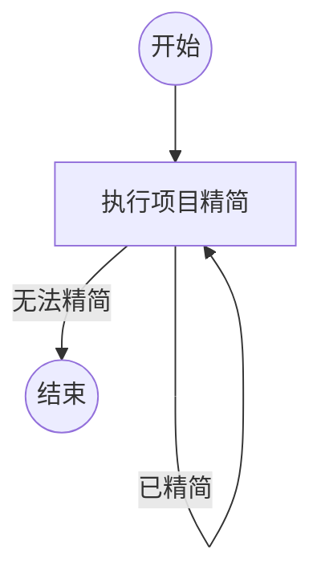

## 执行项目精简

```新建Agent
审视该项目是否存在过度设计、过度校验的问题，能不能考虑不是修补打补丁的方案，而是考虑问题的共性和降低项目维护成本，不要做任何历史兼容工作，任何兼容性的工作都是可以删除的，做一次精简。如果已经无法精简了，可以汇报原因。

请按以下原则完成本节点：

- 先理解项目中待处理问题的共性、重复模式和长期维护成本，再决定修改方案。
- 优先采用能够减少抽象、分支、重复校验和特殊路径的整体方案，不要只做局部补丁。
- 不要保留任何仅为历史版本、旧调用方或旧数据格式服务的兼容逻辑；兼容性工作可以删除。
- 实际完成可以验证的精简，并说明删除或合并了什么，以及为什么不会改变当前需求语义。
- 本节点同时负责门禁判断：每次完成一轮精简后，提交“已精简”，默认回到本节点继续审视和精简；如果本轮没有找到可行的精简方案，提交“无法精简”并结束流程。
- 本 Flow 允许本节点通过循环多次进入；每次进入都重新检查当前状态，不得因为上一轮已经修改过就跳过本轮判断。
- 提交“无法精简”时，必须在 content 中汇报检查范围、保留项和无法继续精简的具体原因。

{outcome}
```

### 已精简

已完成一轮有依据的整体精简，并提供了修改范围、共性问题和验证证据；流程将回到本节点继续审视项目。

### 无法精简

已审视当前项目，没有找到能够在不改变当前需求语义的前提下继续降低复杂度的方案，并在结果中说明了检查范围和原因。
