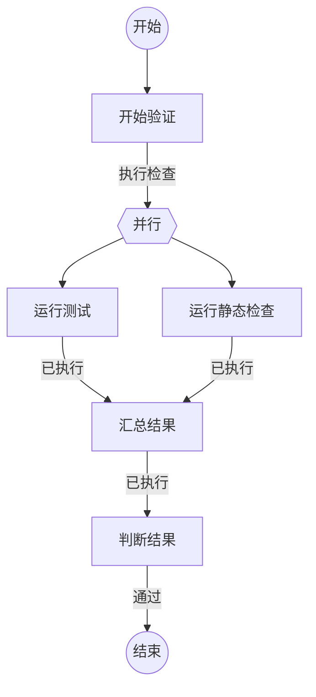

## 开始验证

```新建Agent
准备验证以下任务：
{outcome}
```

### 执行检查

开始独立检查。

## 运行测试

```执行自定义命令
{
  "command": "test",
  "stdin": { "task": "{outcome}" }
}
```

### 已执行

测试命令已经执行。

## 运行静态检查

```执行自定义命令
{
  "command": "lint",
  "stdin": { "task": "{outcome}" }
}
```

### 已执行

静态检查命令已经执行。

## 汇总结果

```执行自定义命令
{
  "command": "merge",
  "stdin": {
    "task": "{outcome}",
    "test": {test.outcome},
    "lint": {lint.outcome}
  }
}
```

### 已执行

已汇总本轮检查结果。

## 判断结果

```复用Agent
判断汇总结果：
{outcome}
```

### 通过

验证已通过。