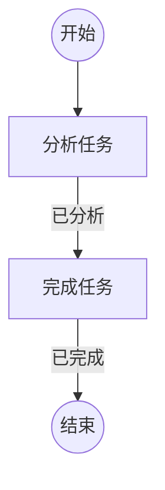

```mermaid
flowchart TD
  start((开始)) --> analyze[分析任务]
  analyze -->|已分析| finishNode[完成任务]
  finishNode -->|已完成| finish((结束))
```

## 分析任务

```新建Agent
分析任务：
{outcome}
```

### 已分析

已得到下一步所需结论。

## 完成任务

```复用Agent
根据分析结果完成任务：
{outcome}
```

### 已完成

任务已结束。