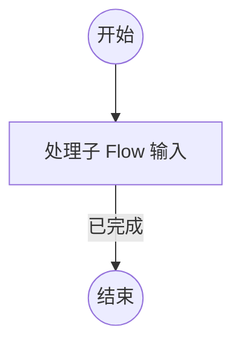

```mermaid
flowchart TD
  start((开始)) --> childCheck[处理子 Flow 输入]
  childCheck -->|已完成| finish((结束))
```

## 处理子 Flow 输入

```新建Agent
子任务：{var.子任务}
父侧变量：{var.父侧变量}
请完成子 Flow 验收，并提交结果和变量更新。
```

### 已完成

| 变量 | 含义 |
| --- | --- |
| 子结果 | 子 Flow 验收结论，包含收到的检查汇总 |

子 Flow 已完成变量处理。
